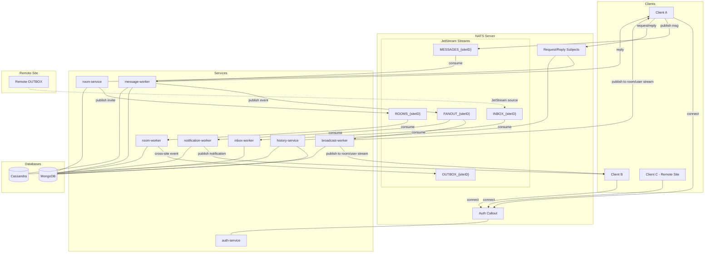
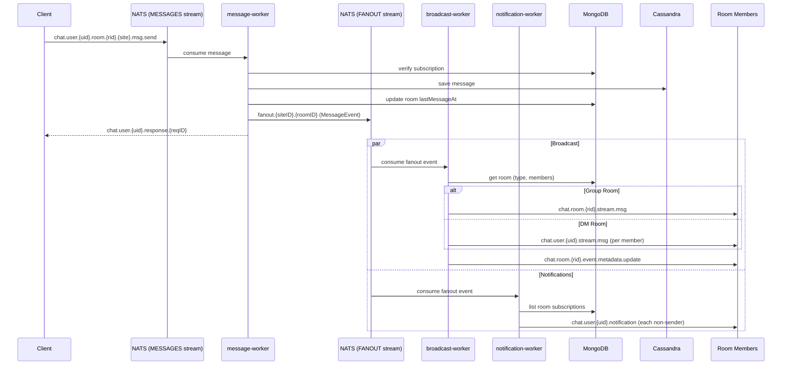
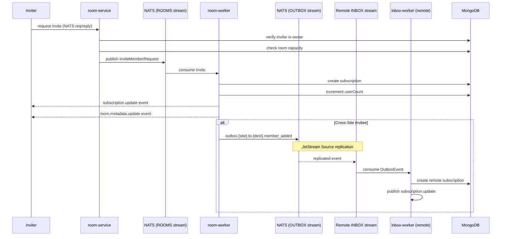

# Architecture Diagram

## System Overview

## Message Flow (Detailed)

## Room Invitation & Federation Flow

## Service-Database Matrix

| Service | MongoDB | Cassandra | NATS Pattern |
|---------|---------|-----------|-------------|
| **auth-service** | - | - | Auth callout |
| **message-worker** | subscriptions, rooms | messages | Consumer (MESSAGES) |
| **broadcast-worker** | subscriptions, rooms | - | Consumer (FANOUT) |
| **notification-worker** | subscriptions | - | Consumer (FANOUT) |
| **room-service** | rooms, subscriptions | - | Request/Reply (Queue) |
| **room-worker** | rooms, subscriptions | - | Consumer (ROOMS) |
| **history-service** | subscriptions | messages | Request/Reply (Queue) |
| **inbox-worker** | rooms, subscriptions | - | Consumer (INBOX) |

## JetStream Streams

| Stream | Subject Pattern | Consumers |
|--------|----------------|-----------|
| `MESSAGES_{siteID}` | `chat.user.*.room.*.{siteID}.msg.>` | message-worker |
| `FANOUT_{siteID}` | `fanout.{siteID}.>` | broadcast-worker, notification-worker |
| `ROOMS_{siteID}` | `chat.user.*.request.room.*.{siteID}.member.>` | room-worker |
| `OUTBOX_{siteID}` | `outbox.{siteID}.>` | Remote INBOX (via Source) |
| `INBOX_{siteID}` | *(sourced from remote OUTBOX)* | inbox-worker |
