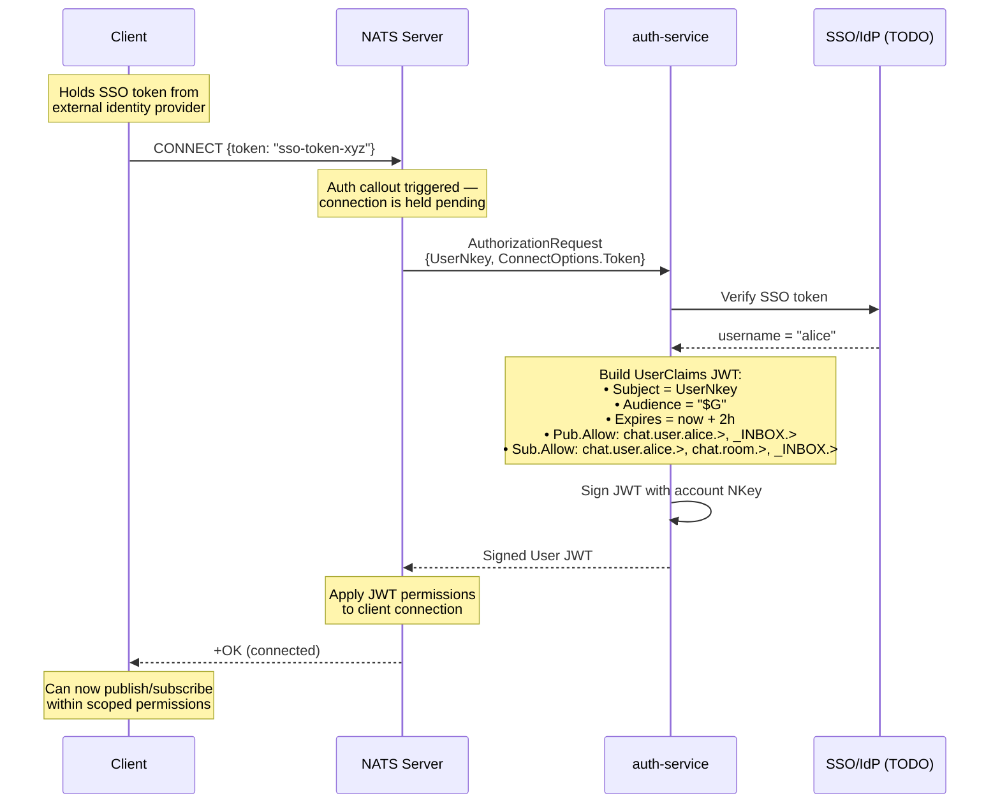
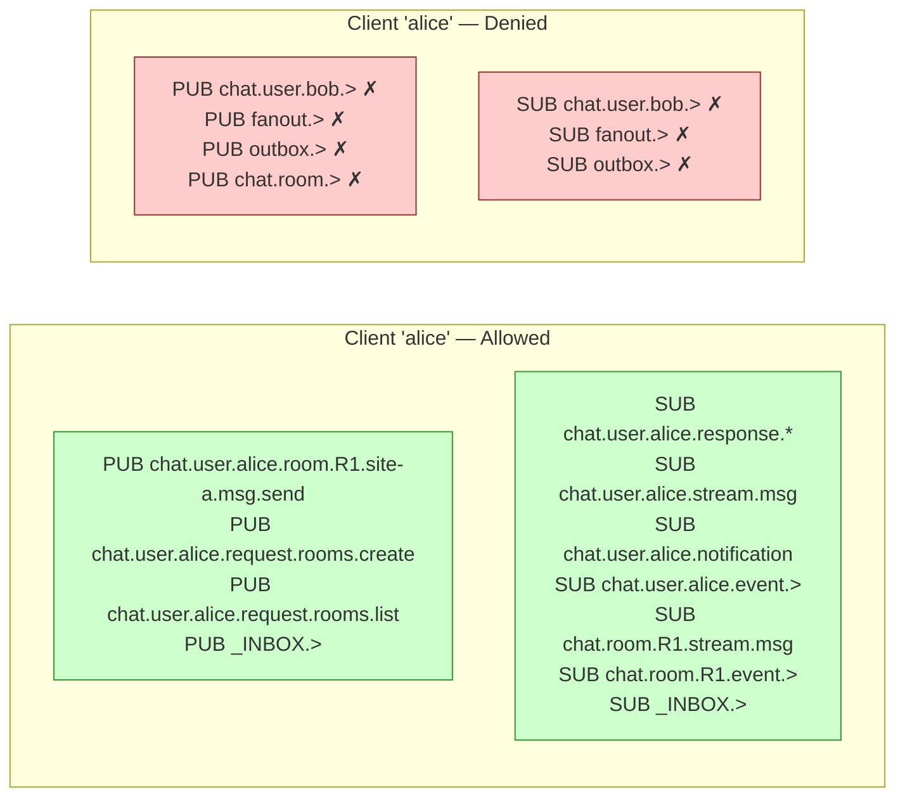
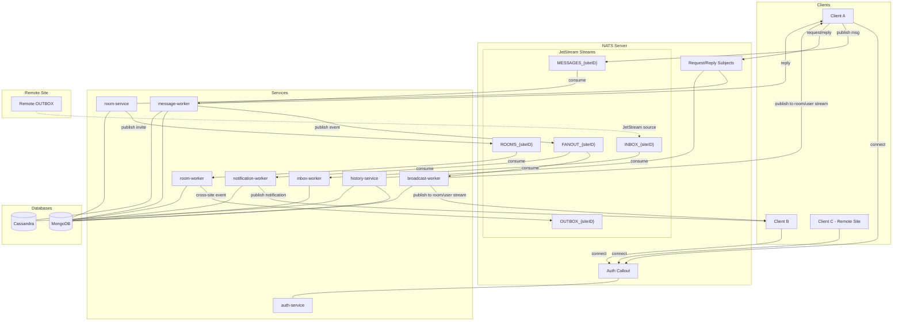
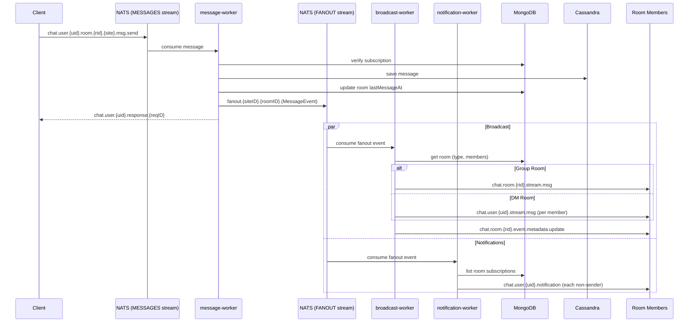
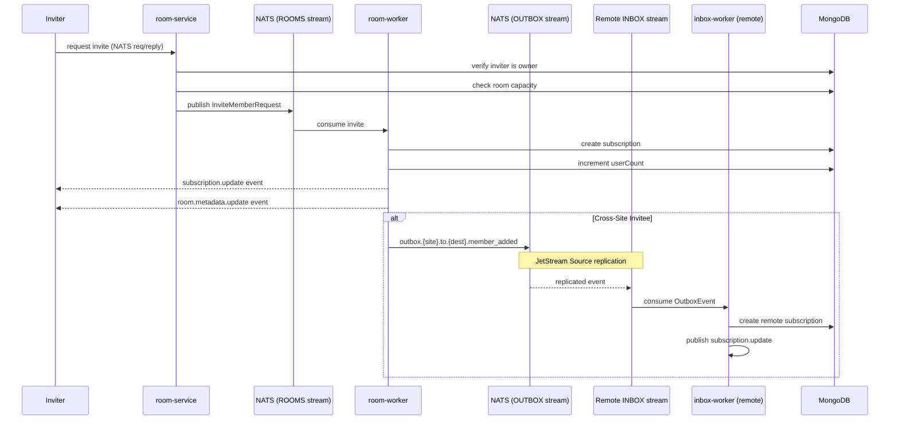

# Architecture Diagram

## Multi-Site Topology

Each site is fully independent — its own NATS server (with JetStream), MongoDB, and Cassandra.
There is no NATS cluster or supercluster. Cross-site federation uses JetStream stream sourcing
(one-way replication from OUTBOX to remote INBOX).

```mermaid
graph TB
    subgraph "Site A"
        subgraph "NATS Server — Site A"
            direction TB
            NATS_A_CORE["NATS Core<br/>:4222"]
            NATS_A_MON["HTTP Monitor<br/>:8222"]
            NATS_A_AUTH["Auth Callout<br/>Endpoint"]

            subgraph "JetStream Engine — Site A"
                MESSAGES_A["MESSAGES_site-a<br/>chat.user.*.room.*.site-a.msg.>"]
                FANOUT_A["FANOUT_site-a<br/>fanout.site-a.>"]
                ROOMS_A["ROOMS_site-a<br/>chat.user.*.request.room.*.site-a.member.>"]
                OUTBOX_A["OUTBOX_site-a<br/>outbox.site-a.>"]
                INBOX_A["INBOX_site-a<br/>(no local subjects — sourced from remote)"]
            end

            RR_A["Core NATS Subjects<br/>Request/Reply + Pub/Sub"]
        end

        AS_A[auth-service]
        MW_A[message-worker]
        BW_A[broadcast-worker]
        NW_A[notification-worker]
        RS_A[room-service]
        RW_A[room-worker]
        HS_A[history-service]
        IW_A[inbox-worker]

        MONGO_A[(MongoDB)]
        CASS_A[(Cassandra)]

        %% Service → NATS connections
        AS_A --- NATS_A_AUTH
        MW_A --- MESSAGES_A
        MW_A --- FANOUT_A
        BW_A --- FANOUT_A
        NW_A --- FANOUT_A
        RS_A --- RR_A
        RS_A --- ROOMS_A
        RW_A --- ROOMS_A
        RW_A --- OUTBOX_A
        HS_A --- RR_A
        IW_A --- INBOX_A

        %% Service → DB connections
        MW_A --- MONGO_A
        MW_A --- CASS_A
        BW_A --- MONGO_A
        NW_A --- MONGO_A
        RS_A --- MONGO_A
        RW_A --- MONGO_A
        HS_A --- MONGO_A
        HS_A --- CASS_A
        IW_A --- MONGO_A
    end

    subgraph "Site B"
        subgraph "NATS Server — Site B"
            direction TB
            NATS_B_CORE["NATS Core<br/>:4222"]
            NATS_B_AUTH["Auth Callout<br/>Endpoint"]

            subgraph "JetStream Engine — Site B"
                OUTBOX_B["OUTBOX_site-b<br/>outbox.site-b.>"]
                INBOX_B["INBOX_site-b<br/>(sourced from Site A OUTBOX)"]
            end
        end

        AS_B[auth-service]
        IW_B[inbox-worker]
        SERVICES_B["... all other services"]

        MONGO_B[(MongoDB)]
        CASS_B[(Cassandra)]

        AS_B --- NATS_B_AUTH
        IW_B --- INBOX_B
        IW_B --- MONGO_B
        SERVICES_B --- NATS_B_CORE
        SERVICES_B --- MONGO_B
        SERVICES_B --- CASS_B
    end

    %% Cross-site federation (JetStream Source — NOT cluster routes)
    OUTBOX_A ==>|"JetStream Source<br/>(one-way replication)"| INBOX_B
    OUTBOX_B ==>|"JetStream Source<br/>(one-way replication)"| INBOX_A

    %% Clients
    CLIENT_A["Client (Site A user)"] -->|"connect(token)"| NATS_A_CORE
    CLIENT_B["Client (Site B user)"] -->|"connect(token)"| NATS_B_CORE

    style OUTBOX_A fill:#f96,stroke:#333
    style INBOX_B fill:#f96,stroke:#333
    style OUTBOX_B fill:#69f,stroke:#333
    style INBOX_A fill:#69f,stroke:#333
```

## NATS Auth Callout Flow

When a client connects, the NATS server delegates authentication to auth-service
via the auth_callout mechanism. The service verifies the SSO token and returns a
signed JWT that scopes the client's publish/subscribe permissions.

### Permission Boundaries After Auth

### Auth Security Model

| Layer | Mechanism | Scope |
|-------|-----------|-------|
| **Transport** | NATS auth_callout | Every connection must present a valid SSO token |
| **Identity** | SSO token → username | Verified by `TokenVerifier` (stub — TODO) |
| **NATS Permissions** | JWT `Pub.Allow` / `Sub.Allow` | User can only publish to own `chat.user.{self}.>` namespace |
| **Room-Level Access** | Application layer (subscription check) | Services verify user is a room member before processing |
| **Cross-Site** | JetStream Source (no direct client access) | Clients never touch OUTBOX/INBOX — only services publish there |

**Key design choice:** NATS permissions enforce *user identity isolation* (alice can't impersonate bob),
but *room-level authorization* is handled by the application (subscription checks in message-worker,
history-service, room-service). Any authenticated user can subscribe to `chat.room.>` at the NATS level,
but services reject requests from non-members.

## System Overview (Single Site)

## Message Flow (Detailed)

## Room Invitation & Federation Flow

## Service-Database Matrix

| Service | MongoDB | Cassandra | NATS Pattern |
|---------|---------|-----------|-------------|
| **auth-service** | - | - | Auth callout |
| **message-worker** | subscriptions, rooms | messages | Consumer (MESSAGES) |
| **broadcast-worker** | subscriptions, rooms | - | Consumer (FANOUT) |
| **notification-worker** | subscriptions | - | Consumer (FANOUT) |
| **room-service** | rooms, subscriptions | - | Request/Reply (Queue) |
| **room-worker** | rooms, subscriptions | - | Consumer (ROOMS) |
| **history-service** | subscriptions | messages | Request/Reply (Queue) |
| **inbox-worker** | rooms, subscriptions | - | Consumer (INBOX) |

## JetStream Streams

| Stream | Subject Pattern | Consumers |
|--------|----------------|-----------|
| `MESSAGES_{siteID}` | `chat.user.*.room.*.{siteID}.msg.>` | message-worker |
| `FANOUT_{siteID}` | `fanout.{siteID}.>` | broadcast-worker, notification-worker |
| `ROOMS_{siteID}` | `chat.user.*.request.room.*.{siteID}.member.>` | room-worker |
| `OUTBOX_{siteID}` | `outbox.{siteID}.>` | Remote INBOX (via Source) |
| `INBOX_{siteID}` | *(sourced from remote OUTBOX)* | inbox-worker |
