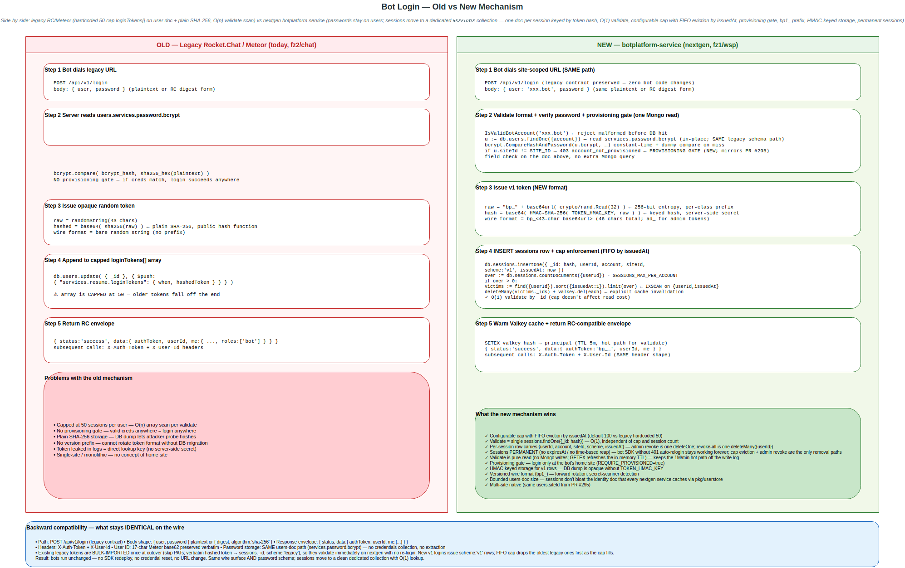
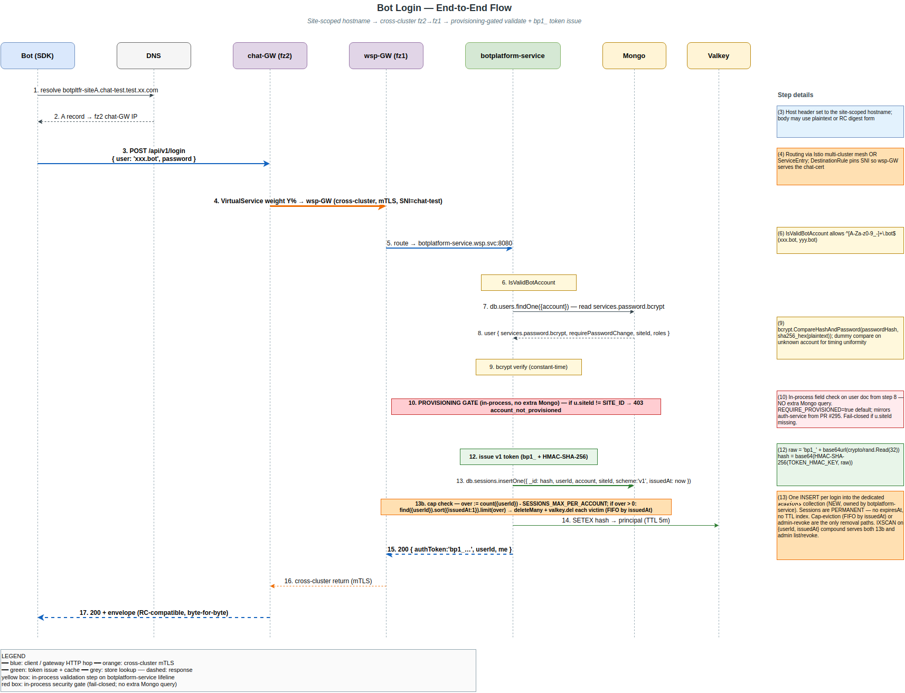
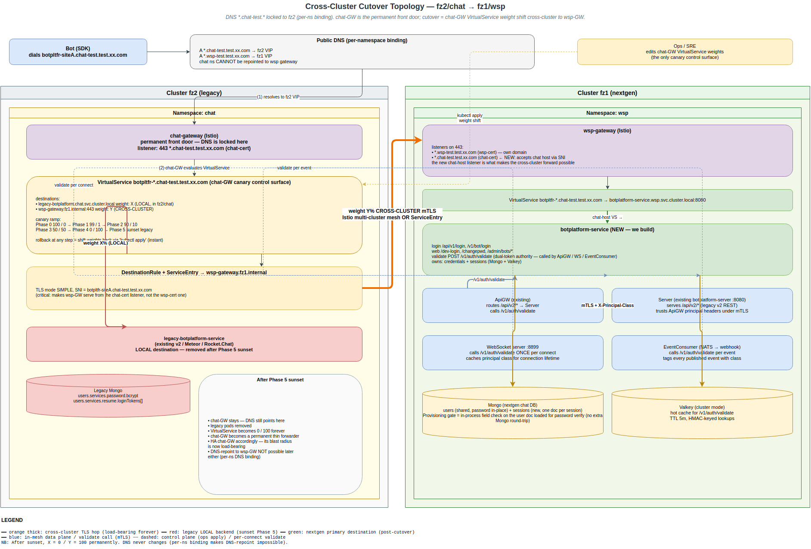

# Bot Platform NextGen — Auth Migration

> **Single combined design spec.** Sections are grouped into three parts: **Part I** (requirements & architecture) for product/architects; **Part II** (technical design) for implementers; **Part III** (components & integration) for downstream service teams. Companion: **[Schema & Migration Runbook](./migration-runbook.md)** (operational).
>
> **Status:** Architecture DECIDED 2026-06-15 (Option B / DEDICATED-SERVICE — see Part I §3). Spec under review for implementation.

---

# Part I — Architecture & Requirements


> **Master spec, Part I.** This document covers the *why*, the *what*, the architecture decision, and the rollout. The **technical design** (data model, algorithms, NATS subjects, config, tests) lives in **[Part II — Technical Design](./auth.md)**. A **Part III — Bot Platform Components Guide** is planned (to be provided).
>
> **Status:** architecture decision DECIDED 2026-06-15 (Option B / DEDICATED-SERVICE — see §3). Spec under review for implementation.

---

## 1. Executive summary

**What:** Build password-based authentication for **bots and admins**, migrating from the legacy v2 repo to the nextgen chat backend.

**Why:**
- The legacy system uses a **capped session array (50-token limit)** per user — both a scaling ceiling and an O(n) validation cost.
- The new system supports **unlimited sessions with O(1) lookup** (one document per session, keyed by token hash).
- It enables **better admin controls**: create bot, rotate password, list/revoke sessions.

**Key constraint:** existing bots using the bot SDK **must keep working with zero code changes** — same URL, same credentials, same request/response contract.

---

## 2. Document map
- **Part I (sections 1–11, below)** — executive summary, architecture decision, business requirements, constraints, security, success criteria, rollout plan, scope.
- **Part II — Technical Design** (further below, after Part I) — `credentials`/`sessions` data model, hashing/verify algorithms, login & validation flows, NATS subjects, gateway topology & performance design, configuration, test plan, verification checklist, open questions.
- **Part III — Components & Integration** (further below, after Part II) — the bot-platform components (`botplatform-server`, websocket server, event consumer), what we build vs. what exists, and the integration points (API proxy, WebSocket auth, token-compatibility phases).

---

## 3. Architecture decision — DECIDED: Option B / DEDICATED-SERVICE (new `botplatform-service`)

> **Naming note.** This spec's Option A/B labels refer **only** to the auth-service placement decision below. The companion **bot-traffic isolation spec** also uses Option A/B/C for its own (different) routing decision — that spec **decides Option A** (subject-namespace split), which is unrelated to this spec's Option A. To avoid the cross-spec letter collision, both specs now pair the letter with a self-describing suffix (e.g. `Option B / DEDICATED-SERVICE` here; `Option A / SUBJECT-SPLIT` there). When citing across specs, always use the suffix.

Where do bot auth + the REST edge live? Two options were weighed (full breakdown in **Part II §7**):

- **Option A / EXTEND-AUTH.** Add password login + stores + middleware + admin RPCs to the existing `auth-service`. *Rejected 2026-06-15.*
- **Option B / DEDICATED-SERVICE. ✅ SELECTED (design-review decision, 2026-06-15).** A dedicated `botplatform-service` for bot password auth + REST→NATS translation + admin ops; `auth-service` stays pure-SSO.

| Criterion | Option A / EXTEND-AUTH | Option B / DEDICATED-SERVICE |
|---|---|---|
| Time to implement | faster | slower |
| Operational complexity | lower | higher |
| Separation of concerns | poor | **good** |
| Risk to human auth | higher | **lower** |
| Long-term maintainability | moderate | **better** |
| Team ownership | single owner | **split ownership** |

**Why B, despite A being faster** (the scope crossed a threshold — it is now **more than a JSON API**):
- **Blast radius / key safety:** `auth-service` holds the JWT signing key and does human SSO; a browser-facing web UI (HTML, cookies, CSRF) is a much larger attack surface that must not share a process with the signing key. Process isolation > file separation.
- **Signing key stays put:** `bot-gateway` never holds the key — it calls `auth-service` to mint JWTs (and only for *native* bot logins; REST bots use the gateway's service-account connection, no per-bot JWT).
- **Independent scaling & deploy:** bot load (10k logins/min, 1M validations/min) and the 1-week bot canary are decoupled from human SSO.
- **Clean sunset:** legacy bot auth (Phase 5) is far easier to retire as a standalone service.

A would have shipped faster but mixes a web app's security model into the human-auth signer. *(Note: A was the right call for the original narrow scope; the web-UI + dual-token additions are what tip it to B.)*

---

## 3a. Interfaces & endpoint paths

`botplatform-service` is the **auth provider** — it does **not** proxy `/api/v2/*` (the existing **ApiGW** routes that to `Server`, calling our validate endpoint for auth). All endpoints are **REST** (Q15):

| Surface | Path | Method | Returns | Auth |
|---|---|---|---|---|
| Web — login form/submit | `/dev-login` | GET/POST | **HTML** / redirect + **cookie** | CSRF (POST) |
| Web — change-pwd | `/changepwd` | GET/POST | **HTML** / redirect | session cookie + CSRF |
| API — legacy bot login | `/api/v1/login` | POST | **JSON** (`authToken`,`userId`,`me`) | — |
| API — new bot login | `/v1/bot/login` | POST | **JSON** (new token) | — |
| API — token validation | `/v1/auth/validate` | POST | **JSON** (`valid`,principal) | `{userId,authToken}` |
| Web — admin console *(role==admin)* | `/admin`, `/admin/bots…` | GET/POST | **HTML** / redirect | admin session cookie + CSRF |

- **`/dev-login` is one role-aware web login** for humans (admin + bot-dev). Admins see an **admin console**; non-admins see a **simple page** (change own password). **Admin is part of the web UI — not a separate API** (Q18).
- **Web routes** use **session cookies** (HttpOnly/Secure/SameSite) + **CSRF**.
- **`/v1/auth/validate`** is called by **ApiGW, the WebSocket server, and EventConsumer** to authenticate bot traffic (replacing legacy-proxy validation). Its response includes a **`principal.class`** field (`"bot"|"user"|"admin"`) so downstream services route traffic by class without re-deriving (consumed by the bot-traffic isolation design).
- **`/api/v1/login`** (legacy contract) + **`/v1/bot/login`** (new) are for **bot processes** (SDK); both via Istio at the same hostnames so bots don't change URLs.
- **All paths in this table are site-scoped via the hostname** — every site runs its own `botplatform-service` reachable at `{service}-{site}.chat-test.test.xx.com` (e.g. `botpltfr-siteA.…`). There is no central front door and no cross-site rewriting. A bot dials its home site directly; the provisioning gate (§5) refuses logins targeting any other site.

---

## 4. Business requirements — user stories

### US1 — Bot login
*As a bot, I want to log in with username/password to get an auth token.*
- Accept `{ user, password }` (plaintext or RC digest form).
- Return `authToken`, `userId`, `me`.
- **Performance: P99 < 200 ms** (stretch goal < 100 ms).
- **Must match the legacy response format exactly.**

### US2 — Session-based API access
*As an authenticated bot, I want to make API calls using my token.*
- Headers: `X-Auth-Token` + `X-User-Id`.
- **No session limits** — replaces the legacy 50-cap.
- Validation latency: **< 5 ms cached, < 50 ms uncached**.
- Support **1,000,000 validations / minute**.

### US3 — Long-lived sessions
*As a bot, I want my sessions to stay valid while I'm active.*
- No expiry while active.
- Auto-expire after **180 days idle**.
- Extend on each use (**sliding window**).

### US4 — Admin bot creation
*As an admin, I want to create new bot accounts.*
- Set a temporary password.
- Force password change on first login.
- **Only admins** can create.

### US5 — Password rotation
*As an admin, I want to reset bot passwords.*
- Change the password immediately.
- **Revoke all existing sessions.**
- Force re-login.

### US6 — Session management
*As an admin, I want to see and revoke bot sessions.*
- List all active sessions.
- Show last-used time.
- Revoke an individual session or all of them.

### US7 — Web login (browser)
*As an admin/developer, I want to log in through a web page.*
- `GET /dev-login` serves an **HTML** form; `POST /dev-login` submits it.
- On success, set a **session cookie** (HttpOnly/Secure/SameSite) and redirect.
- **CSRF-protected.**

### US8 — Web change-password (browser)
*As a logged-in user, I want to change my password through a web page.*
- `GET /changepwd` serves an **HTML** form; `POST /changepwd` submits it.
- Requires a valid session cookie + **CSRF** token.
- On success, **revoke other sessions** and force re-login (consistent with US5).

---

## 5. Critical constraints
- **User IDs:** 17-char Meteor format (**not** UUID).
- **Passwords:** `bcrypt(sha256_hex(plaintext))`, **cost = 10**.
- **Tokens (dual-format during hybrid phase, Part II §4.3):**
  - Legacy tokens: opaque random, stored `base64(sha256(rawToken))` — byte-for-byte RC compatibility.
  - Native v1 tokens: `bp1_<43-char base64url of 32 random bytes>`, stored `base64(HMAC-SHA-256(server_secret, rawToken))`.
  - Validator dispatches on the `bp1_` prefix; legacy fallback only for prefix-less tokens.
- **IDs must be preserved from legacy** — no remapping layer (the v2 Go repo already preserves the 17-char `_id`).
- **Provisioning-gated login.** After credential verification, the account's `{userId, siteId}` must exist in this site's `users` collection; otherwise `403 account_not_provisioned`. Mirrors the auth-service gate introduced in PR #295. Controlled by `REQUIRE_PROVISIONED=true` (default); fail-closed on store errors.
- **Single home site per bot.** A bot is provisioned at exactly one site (its home site), identified by `siteId` on its user record. Login is accepted only at that site's `botplatform-service`. Cross-site interaction happens via NATS supercluster federation, never via cross-site login.
- **Bot account → subject-token normalization.** Bot accounts use the legacy `*.bot` suffix (`xxx.bot`, `yyy.bot`), which contains a `.` and would multi-tokenize unsafely if used raw in a NATS subject. The subject-side token is the **dot-normalized form** (`xxx.bot` → `xxx_bot`) produced by `subject.BotAccountToken`. Bot NATS subjects scope to **`chat.bot.{botToken}.>`** — never the `chat.user.>` namespace, eliminating ACL overlap between human `xxx` and bot `xxx.bot` (Part II §4.4). Validation: `subject.IsValidBotAccount` accepts the legacy `^[A-Za-z0-9_-]+\.bot$` shape; the strict `subject.IsValidAccountToken` from PR #295 continues to apply to human accounts on `chat.user.>`.

---

## 6. Migration
- **Import password hashes verbatim** — never rehash or recompute (we don't hold the plaintext).
- **Import active login tokens only.**
- **Skip personal access tokens** (`type:"personalAccessToken"`) — not used by bots.
- **Zero bot code changes required.**
- **Credential import and provisioning are coordinated.** The same migration job that writes `credentials` writes the `{userId, siteId}` membership row to that site's `users` collection. A credential without a provisioning row results in a correct-but-confusing `account_not_provisioned` 403; the migration order prevents that window. Until the multi-site rollout actually lights up >1 nextgen site, every migrated bot lands at the single nextgen site (gate is essentially a no-op safety belt).

**Dual-token validation (during migration):**
- **Accept old Rocket.Chat tokens** (imported, validated against the same store).
- **Issue new botplatform tokens** on every fresh login.
- **Gradually phase out old tokens** — as bots re-login they get new tokens; legacy tokens age out via the 180-day sliding window and can eventually be rejected outright once telemetry shows none in use.

---

## 7. Security
- **Never log** tokens or passwords (or their hashes).
- **Timing-safe credential comparison** (run bcrypt even on unknown accounts; uniform error/timing — no account enumeration).
- **Rate limiting:** 5 failed attempts → **15-minute lockout**.
- **HTTPS only.**
- **CSRF protection on all web (form) routes** (`/dev-login`, `/changepwd`); API/token routes are exempt (no ambient cookie credential).
- **Session cookies for web** — HttpOnly, Secure, SameSite — distinct from API bearer tokens. Both resolve to the same session store.

---

## 8. Success criteria

**Performance**
- Login **P99 < 200 ms** (ideally < 100 ms).
- Token validation **P99 < 5 ms cached**.
- **Cache hit ratio > 95%**.
- Sustain **10k logins/min, 1M validations/min**.

**Migration**
- **Zero downtime** via Istio canary.
- **1% → 100% traffic over ~1 week**.
- **Rollback within 1 hour.**
- **Zero data loss.**

---

## 9. Migration plan (phases)

**Phase 1 — Foundation**
- Deploy the auth service with the login API.
- Create the session store.
- Build the migration script.

**Phase 2 — Integration**
- Update the API gateway with token validation.
- Test bot-platform server routing.
- Fix WebSocket authentication.

**Phase 3 — Data migration**
- Freeze legacy auth.
- Run migration (dry-run + live).
- Verify counts.

**Phase 4 — Cutover**
- Istio canary 1% → 10% → 50% → 100%.
- Monitor 24h.
- Dashboard gate: error rate **< 0.1%**.

**Phase 5 — Cleanup**
- Monitor stability.
- Sunset legacy auth (v2 Go repo auth, and possibly v1 auth).
- Update documentation.

---

## 10. Diagrams

Source-of-truth `.drawio` files live in `docs/specs/diagrams/`. PNG previews embedded below render the same diagram and round-trip to draw.io desktop (XML is embedded).

### 10.1 Old vs new login mechanism



Side-by-side comparison — legacy Rocket.Chat (capped session array, plain SHA-256, no provisioning gate) vs nextgen botplatform-service (unlimited sessions, HMAC-keyed storage, provisioning gate). Bottom panel calls out the wire-level backward compatibility that keeps bots running unchanged.

Source: [`login-old-vs-new.drawio`](./diagrams/login-old-vs-new.drawio) · PNG: [`login-old-vs-new.drawio.png`](./diagrams/login-old-vs-new.drawio.png)

### 10.2 Token generation & validation flow


Top half = generation pipeline (login → bcrypt verify → 32 bytes random → base64url → `bp1_` prefix → HMAC-SHA-256 storage hash → INSERT sessions). Bottom half = validation with prefix-dispatch (Valkey cache hot path, Mongo cold path, legacy-store fallback only for pre-prefix tokens). Embedded rationale block in the middle explains why each design choice — see Part II §4.3.

Source: [`token-gen-validate-flow.drawio`](./diagrams/token-gen-validate-flow.drawio) · PNG: [`token-gen-validate-flow.drawio.png`](./diagrams/token-gen-validate-flow.drawio.png)

### 10.3 Bot login — end-to-end flow



17-step sequence diagram covering the whole wire path: Bot → DNS → chat-GW (fz2) → wsp-GW (fz1) → botplatform-service → Mongo + Valkey. Provisioning gate (red), in-process steps (yellow), token issue (green), cross-cluster mTLS hop (orange). Right-side annotation panel carries the long detail strings out of the arrow labels.

Source: [`bot-login-flow.drawio`](./diagrams/bot-login-flow.drawio) · PNG: [`bot-login-flow.drawio.png`](./diagrams/bot-login-flow.drawio.png)

### 10.4 Cross-cluster cutover topology



Topology + canary control surface. Per-namespace DNS binding visible at the top (the reason DNS-repoint to wsp gateway is infeasible). chat-GW VirtualService weights X% local + Y% cross-cluster. wsp-GW listens on both `*.wsp-test.*` and `*.chat-test.*` (the new chat-cert server block accepts the forwarded traffic). botplatform-service + ApiGW + Server + WS + EventConsumer + stores in fz1/wsp. Steady-state note on the right side of fz2 explains the permanent thin-forwarder shape after sunset.

Source: [`cross-cluster-cutover.drawio`](./diagrams/cross-cluster-cutover.drawio) · PNG: [`cross-cluster-cutover.drawio.png`](./diagrams/cross-cluster-cutover.drawio.png)

### 10.5 Regeneration

Open any `.drawio` source in draw.io desktop (or paste into [app.diagrams.net](https://app.diagrams.net)) to edit. Re-export with:

```bash
drawio -x -f png -e -s 2 docs/specs/diagrams/<file>.drawio
# headless Linux: prefix with `HOME=/tmp xvfb-run -a` and append `--no-sandbox` at the END
```

### 10.6 Other diagrams

- [Bot Platform NextGen — Auth Architecture](https://www.figma.com/board/fcnw0N493MwYeQBgXuA3qu) — FigJam whiteboard, earlier-iteration architecture overview. The `.drawio` files above are the up-to-date source.

---

## 11. Out of scope
- Human SSO/OIDC (unchanged; stays in `auth-service`).
- Bot permissions (separate system).
- Message routing (separate).
- **Personal access tokens** — bots don't use them. **Recommendation: do not support in this phase** — the session model already covers every bot need (login, long-lived tokens, unlimited sessions). PATs are a human-user feature with no bot benefit here; revisit only if/when human REST API access moves to the nextgen stack.
- **General user administration** (humans + bots — list, search, view profile, change role, deactivate, audit) is **NOT in this spec**. The `/admin/bots…` surface here is **bot-specific** (create / rotate password / list-or-revoke sessions for a bot account). A separate spec is needed for `/admin/users…` because:
  - **Write path ownership** — it writes to the shared `users` collection owned by the PR #295 / portal-service team (we only read from it for the provisioning gate).
  - **Permission boundaries** — site-admin vs super-admin, cross-site visibility, audit log — the bot-only admin surface doesn't need any of these.
  - **UX surface** — search across N users, bulk operations, role pickers; bot admin is a tiny CRUD by comparison.

  Likely home for the follow-up spec: `docs/specs/botplatform/admin-user-management.md` if owned by this team (the admin web UI plumbing — `/dev-login` session, CSRF, role-gating — is already here). Alternative: `docs/specs/portal/…` if the portal-service team picks it up. Tracked as a follow-up; the bot admin surface here is intentionally bounded.


---

# Part II — Technical Design


> **Part II — Technical Design.** Builds on Part I (above). Section numbering restarts at §1 within this part. Cross-references like "Part II §4.3" refer to sections inside this part; bare "§X" cites within the same part.
>
> **Status:** DESIGN-COMPLETE — pending verification against the internal (legacy RC fork + nextgen) codebase. §22 is the verification checklist to run before this becomes an implementation plan. Open questions are tracked in §12 (all but two resolved).

*Bring password-based login (admins + bots) and durable session management to the nextgen NATS-native stack, migrating credentials from the legacy Rocket.Chat (RC) Mongo `users` collection without forcing any bot developer to change URLs, credentials, or client code, and cut over behind the shared Istio gateway with zero downtime.*

---

## 1. Goal & non-goals

### Goals
1. **Transparent migration for existing accounts.** Admins and bots that authenticate today via the legacy password endpoint keep the same URL, the same credentials, and the same request/response contract. No password resets, no client changes.
2. **Unlimited concurrent sessions, constant-time validation.** Remove the legacy per-user capped token array; support any number of live sessions per account with O(1) token lookup.
3. **Net-new operator surface.** A NATS-native operator UI (+ its request/reply handlers) for admin login and bot provisioning/management (create bot, set/rotate password, list/revoke sessions).
4. **Zero-downtime cutover** behind the shared Istio gateway, same public URL, new namespace.

### Non-goals (out of scope)
- The exact legacy REST **endpoint surface** and its full subject-mapping table (owned by the gateway track). This spec designs the auth model + the gateway's *responsibilities and topology* (§9), not the per-verb mapping.
- Room/message/federation dual-write consistency during cutover — a separate track (§10.4 flags the boundary only).

---

## 2. Current state (grounded)

Verified against the repo (`auth-service/`, `pkg/userstore`, `pkg/model`, `pkg/subject`):

- **`auth-service` is OIDC/SSO-only.** `POST /auth` (`auth-service/routes.go:5`) validates an SSO token (or a dev account name in dev mode), then signs a **NATS user JWT** with scoped pub/sub permissions using the account signing key (`AUTH_SIGNING_KEY`). See `auth-service/handler.go:234-249` for the grants (`chat.user.{account}.>`, `chat.room.>`, `_INBOX.>`).
- **Clients talk to NATS directly** after `/auth`. There is no HTTP→NATS gateway in the repo; all RPC is NATS request/reply via `pkg/natsrouter`.
- **No password storage, no bcrypt, no session/login-token store exists anywhere.** Clean slate — no legacy auth code in the nextgen repo to refactor around.
- **Identity already works for bots.** `model.User` (`pkg/model/user.go`) carries `Account`, `SiteID`, `Roles`, display names; `model.IsBotAccount` (`pkg/model/account.go`) classifies bots by `*.bot` suffix / `p_` prefix; `pkg/userstore` resolves any account through a pod-local LRU+singleflight cache.
- **JWT minting is reusable** — exactly what a password login needs after credential verification.

### 2.1 Legacy Rocket.Chat reference (verified against RC/Meteor)

The legacy system is Rocket.Chat. Confirmed behavior the migration must honor:

- **Login request** — `POST /api/v1/login` (the deployment's `/dev-login` is a fork-specific route, mechanics identical; exact path/body to confirm, §12 Q1). Body accepts **either** plaintext `{ user, password }` **or** a pre-hashed `{ user, password: { digest: <sha256-hex>, algorithm: "sha-256" } }`. Clients may use either form, so the nextgen login path must accept **both**.
- **Login response** — `{ "status":"success", "data":{ "authToken":"<raw>", "userId":"<17-char>", "me":{ "_id", "username", "name", "active", "roles":["bot"] } } }`. Subsequent calls authenticate with headers **`X-Auth-Token: <raw>`** + **`X-User-Id: <17-char>`**. (Full contract confirmed, §12 Q1.)
- **Password storage** — `users.services.password.bcrypt` = `bcrypt(sha256_hex(password))` (Meteor accounts-password). Verification: hex-SHA-256 the incoming plaintext (or take the client-supplied `digest`), then `bcrypt.CompareHashAndPassword`.
- **Login-token storage** — `users.services.resume.loginTokens[]`, each `{ when, hashedToken }` where **`hashedToken = base64(sha256(rawToken))`** (Meteor `Accounts._hashLoginToken`). The raw token is the `X-Auth-Token`; the server hashes the inbound token and matches.

> Sources: RC REST auth (`developer.rocket.chat`, RocketChat/Rocket.Chat issue #5466), RC password format (forums.rocket.chat "Password format in database"), Meteor `Accounts._hashLoginToken` (Meteor forums / accounts-base). Cited in chat.

**Implication:** identity is solved; we add (a) a credential store, (b) a session store using RC's exact token-hash form, (c) a password-login path that reuses JWT minting, (d) provisioning handlers + UI, (e) the gateway (§9).

### 2.2 Confirmed by internal codebase analysis (2026-06-15)

- **Bots authenticate with password only**, via the Node.js bot SDK calling `POST /api/v1/login`. **No PAT usage among bots** — Personal Access Tokens are a *human-user* feature. ⇒ PATs are **out of scope**; the session model carries no PAT `type`/`name` fields and migration imports no PAT tokens (§6 simplified, Q8 resolved).
- **`users._id` is a 17-char Meteor ID**, and the v2 Go repo **preserves the legacy `_id` verbatim** through identity-sync. ⇒ nextgen `users._id` == legacy `_id` == the `X-User-Id` a bot sends. **No ID-mapping layer, no `LegacyUserID` field** (Q9 resolved).

---

## 3. Key design decisions

| Concern | Decision | Why |
|---|---|---|
| Bot/admin **identity** | Stays in the shared `users` collection (roles distinguish admin/bot/user) | Every downstream service resolves accounts through the cached `userstore`; a second identity collection forces double lookups and breaks display-name/federation resolution. |
| **Credentials** | New `credentials` collection, owned by `botplatform-service` (the §7 Option B / DEDICATED-SERVICE choice) | `users` is read-only shared infra cached fleet-wide; a bcrypt hash must not ride in a broadly-cached identity doc, and only the auth service verifies passwords. |
| **Sessions** | New `sessions` collection, **one doc per session** keyed by a per-row token hash (see §4.3 for the dual-hash scheme: legacy rows use `base64(sha256(token))`, native `v1` rows use `base64(HMAC-SHA-256(server_secret, token))`) | Eliminates the legacy capped array; O(1) lookup independent of session count; sliding idle expiry (§5.5); per-session + per-account revocation. Dual hash preserves bit-for-bit legacy compatibility while raising the storage-leak bar for new tokens. |
| **Token wire format** | Native `v1` tokens carry a `bp1_` namespace prefix (`bp1_<43-char base64url of 32 random bytes>`); legacy tokens unchanged (§4.3) | Prefix unlocks a single-store fast path for native tokens (no legacy fallback lookup), enables forward-versioning (`bp2_`…), and is detected by every standard secret-scanner. |
| **Scope** | Credentials + sessions are **account-agnostic** (admins *and* bots) | The legacy login authenticates admins too — shared password-login infrastructure, not bot-only. |
| **NATS JWT** | Short-lived, **minted from a valid session**, refreshed without re-entering the password | Reuses existing JWT machinery; session = durable login, JWT = ephemeral capability. |
| **Validation hot path** | Mongo durable + **read-through cache (in-pod LRU + Valkey)** | Every REST call validates a token; a Mongo read per call is the bottleneck (§9.3). |

---

## 4. Data model

### 4.1 `credentials` collection
One document per password-login account (admin or bot), keyed to `users._id`.

| Field | Type | Tags | Notes |
|---|---|---|---|
| ID | `string` | `bson:"_id"` | = `users._id`, a **17-char Meteor ID** preserved verbatim from legacy by identity-sync (Q9). **Not** a generated UUIDv7 — these IDs come from the legacy system, not `idgen`. |
| Account | `string` | `bson:"account" json:"account"` | Login username (`username@domain` form). Unique index. |
| PasswordHash | `string` | `bson:"passwordHash" json:"-"` | Migrated verbatim from `services.password.bcrypt`. **Never serialized.** |
| PasswordScheme | `string` | `bson:"passwordScheme" json:"-"` | `"rc-sha256-bcrypt"` = `bcrypt(sha256_hex(pw))`. Verification accepts plaintext **or** RC `{digest,algorithm:"sha-256"}` input (§2.1). |
| RequirePasswordChange | `bool` | `bson:"requirePasswordChange" json:"requirePasswordChange"` | Migrated; drives first-login (§5.4). |
| CreatedAt / UpdatedAt | `int64` | `bson:"createdAt"` / `bson:"updatedAt"` | ms since epoch; `UpdatedAt` bumped on password change. |

Indexes: unique on `account`.

### 4.2 `sessions` collection
One document per live session. **No array, no cap.**

| Field | Type | Tags | Notes |
|---|---|---|---|
| TokenHash | `string` | `bson:"_id"` | Per-row hash, function determined by `Scheme` (§4.3). `legacy` rows: `base64(sha256(rawToken))` (RC/Meteor form, byte-for-byte). `v1` rows: `base64(HMAC-SHA-256(server_secret, rawToken))`. Lookup key; raw token never stored. |
| UserID | `string` | `bson:"userId" json:"userId"` | = `users._id` (17-char Meteor ID; same id space the bot sends as `X-User-Id` — no mapping). Indexed (revoke-all / list). |
| Account | `string` | `bson:"account" json:"account"` | Denormalized (`username@domain`). **Kept** so validation returns the account directly — the gateway needs it to build `chat.user.{account}.…` subjects and inject the principal, avoiding a second `userstore` lookup per request. |
| Scheme | `string` | `bson:"scheme" json:"scheme"` | `"legacy"` (imported RC tokens, §6.2) or `"v1"` (nextgen-issued). No PAT type — bots are password-only; PATs are a human-user feature, out of scope (§2.2). |
| IssuedAt | `int64` | `bson:"issuedAt" json:"issuedAt"` | ms since epoch. |
| LastUsedAt | `int64` | `bson:"lastUsedAt" json:"lastUsedAt"` | **Throttled** write (§12 Q4) — not every request. |
| ExpiresAt | `*time.Time` | `bson:"expiresAt,omitempty" json:"expiresAt,omitempty"` | **Sliding idle expiry** (§5.5): pushed to `now + idleWindow` on the throttled use-bump. `nil`/absent ⇒ never expires (pure-infinite mode). |

Indexes: `_id` (token hash); `userId`; **partial TTL** on `expiresAt` (`expireAfterSeconds:0`, partial filter `{expiresAt:{$exists:true}}` so null/infinite sessions are never reaped).

**Why this beats the legacy array:** RC embedded a `loginTokens[]` array on the user doc → unbounded doc growth, O(n) scan per request, hence a cap. Per-session docs keyed by hash make validation O(1) regardless of session count, so the cap disappears.

### 4.3 Token format & storage hash (Q10 — DECIDED 2026-06-16, supersedes the earlier "same format" stance)

Two formats coexist for the duration of the hybrid phase. Both are stateful opaque tokens — see §3 for why this is not JWT — but they differ in wire shape and storage-hash function.

| Aspect | Legacy (`scheme:"legacy"`) | Native v1 (`scheme:"v1"`) |
|---|---|---|
| Wire format | Opaque random string (RC/Meteor shape) — no prefix | **`bp1_<43-char base64url of 32 random bytes>`** (256 bits of entropy) |
| Storage hash | `base64(sha256(rawToken))` — Meteor `Accounts._hashLoginToken`, byte-for-byte | **`base64(HMAC-SHA-256(server_secret, rawToken))`** |
| Source | Imported from `users.services.resume.loginTokens[]` (§6.2) | Issued by `botplatform-service` on every fresh login (§5.1) |

**Why the `bp1_` prefix on new tokens:**
- **Validation fast-path.** Validator inspects the token: starts with `bp1_` → look up in the v1 namespace **only** (HMAC hash); else legacy → SHA-256 hash, our store first then legacy-store fallback. No double-lookup on native tokens.
- **Forward versioning.** When (not if) the token shape rotates — new entropy length, embedded checksum, algorithm change — `bp1_` → `bp2_` lets both formats coexist with zero ambiguity at the validator.
- **Leaked-secret detection.** GitHub secret scanning, gitleaks, trufflehog all key off prefixes. A `bp1_…` value in a public repo gets flagged automatically. A bare base64 string doesn't.
- Cost: 4 bytes on the wire. Negligible.

**Why HMAC-SHA-256 storage for v1 (not plain SHA-256):**
- **Hardens against offline attack on a stolen sessions table.** Plain SHA-256 is a public deterministic function — a DB dump lets an attacker probe hash guesses. HMAC keys the hash on a server secret only `botplatform-service` holds; without the secret, the dump is opaque even if the attacker knew the algorithm. (Token entropy is 256 bits, so SHA-256 brute-force is already infeasible — this is defense in depth.)
- **Decouples in-DB hashes from public hash equality.** Plain `sha256(token)` is the same value everywhere; HMAC binds the storage key to our server. Logs / error reports that leak the hash don't give an attacker a usable lookup key.
- **Cost is identical.** HMAC-SHA-256 is two SHA-256s — both ~free at our throughput. No measurable latency impact on the 1M-validations/min path.
- **Storage size identical.** 32-byte digest → 44-char base64.

**Why NOT bcrypt/Argon2/scrypt for token storage:**
- Slow hashes exist for low-entropy inputs (passwords). Tokens have 256 bits of entropy — slow-hashing them is pure cost. 1M validations/min × 100 ms bcrypt = 1,667 cores wasted on a problem we don't have.
- Passwords still use bcrypt (§14). Tokens don't. Different inputs, different tools.

**Why NOT JWT / PASETO:**
- We need cheap revocation (US5), session enumeration (US6), sliding idle expiry, per-site issuance, and ≤5 ms cached validation at 1M/min. Stateful opaque tokens give all of those; JWTs make revocation and enumeration into separate operational problems while saving nothing meaningful (Valkey cache handles the lookup latency).

**Why NOT rotating bot tokens:**
- Bots are long-lived processes, not browsers. Rotating their access tokens would force credential reloads across the bot fleet for marginal security gain. Stable + revocable + idle-expiring is the right shape for bot tokens. (Web *admin* sessions are a separate question — rotating session cookies per request is reasonable there, tracked separately.)

**Server-secret rotation (HMAC key):** the HMAC `server_secret` is loaded from `TOKEN_HMAC_KEY` (env, required for v1). Rotating it requires a graceful key-rollover: keep the previous key as `TOKEN_HMAC_KEY_PREVIOUS` for one `idleWindow` so existing sessions validate against either key, then drop. Documented in §16.

### 4.4 Bot account namespace & subject tokens (DECIDED 2026-06-16)

Bot accounts in production carry the legacy `*.bot` suffix (`xxx.bot`, `yyy.bot`, confirmed against the v2 Mongo `users` collection). The `.` is unsafe as a NATS subject token — it would multi-tokenize, and `chat.user.xxx.bot.…` (4 account tokens) would let a human account `xxx` (grant `chat.user.xxx.>`) match a bot account `xxx.bot`'s subject space. That's an ACL escape, separate from the format-validation problem PR #295 introduces.

**Two-layer fix.** The Mongo identity is unchanged; the change is at the NATS subject layer.

#### Layer 1 — separate top-level namespace
Bot subjects live on **`chat.bot.>`**, never under `chat.user.>`. Top-level token disambiguates classes — a human grant `chat.user.xxx.>` and a bot grant `chat.bot.xxx_bot.>` cannot overlap regardless of how the account tokens are derived. This is also the same namespace the bot-traffic isolation spec uses for class routing, so the two specs converge on a single ontology.

#### Layer 2 — normalize the account into a subject-safe token
```go
// pkg/subject/account.go (new — added in this spec's PR)

// BotAccountToken converts a bot account ("xxx.bot") into the NATS-safe subject
// token ("xxx_bot"). Preserves the .bot information so the token remains round-
// trippable back to the account identity (replace _bot$ with .bot).
func BotAccountToken(account string) string {
    return strings.ReplaceAll(account, ".", "_")
}

// IsValidBotAccount accepts exactly the legacy bot shape: <token>.bot where
// <token> matches the strict IsValidAccountToken rule. Used at the login path
// to refuse anything that wouldn't normalize cleanly.
var botAccountRE = regexp.MustCompile(`^[A-Za-z0-9_-]+\.bot$`)

func IsValidBotAccount(account string) bool {
    return botAccountRE.MatchString(account)
}
```

Concrete result:

| Account in Mongo | Subject namespace | Subject token | JWT scope |
|---|---|---|---|
| `alice` (human) | `chat.user.>` | `alice` | `chat.user.alice.>` |
| `xxx.bot` (bot) | `chat.bot.>` | `xxx_bot` | `chat.bot.xxx_bot.>` |
| `yyy.bot` (bot) | `chat.bot.>` | `yyy_bot` | `chat.bot.yyy_bot.>` |
| `xxx` (human) vs `xxx.bot` (bot) | disjoint top-level tokens | — | **no overlap** ✅ |

#### Validation dispatch by class
Both validators are always present:

- **Human login (auth-service OIDC):** validates `claims.preferred_username` with `subject.IsValidAccountToken` (the strict PR #295 form — no dots).
- **Bot login (botplatform-service `/api/v1/login`, `/v1/bot/login`):** validates `user` field with `subject.IsValidBotAccount` (allows the `*.bot` shape only).
- The subject derived for either is always strict-safe after normalization — no path produces a subject token containing `.`, `*`, `>`, whitespace, or control characters.

#### Why this resolves the PR #295 conflict
PR #295 introduces `subject.IsValidAccountToken` (rejects accounts containing `.`) as a routing-layer invariant before any account reaches `chat.user.{account}.>`. As-shipped it would reject every production bot. With this fix:

- Bots never reach `chat.user.{account}.>` — they're on `chat.bot.{botToken}.>` instead, so the human-side validator never sees them.
- The bot side has its own validator (`IsValidBotAccount`) tuned to the bot shape.
- The subject token (`xxx_bot`) is itself dot-free, so any downstream `IsValidAccountToken` check on the token (not the raw account) passes.

`pkg/subject` will have **both** validators side-by-side; callers pick the right one for their class. JWT grants are minted from the appropriate scope based on the principal's class (auth-service mints `chat.user.{account}.>` for SSO humans; botplatform-service requests JWT minting at `chat.bot.{botToken}.>` for bots).

---

## 5. Login & session flows

### 5.1 Password login (admin or bot)
1. Client `POST`s `{ user, password }` (plaintext **or** RC digest form) to **`POST /api/v1/login`** (the confirmed path, §12 Q1).
2. Auth service loads `credentials` by account; derives `sha256_hex(pw)` (or uses the supplied digest); `bcrypt.CompareHashAndPassword` against `PasswordHash`. Constant-time; uniform error on unknown-account vs bad-password.
3. **Provisioning gate (when `REQUIRE_PROVISIONED=true`, default):** look up `{userId, siteId}` in this site's `users` collection. **Miss → `403 account_not_provisioned`.** Store error → **fail closed** (same `403`, loud server-side log). Disabling the gate logs a loud startup warning. Mirrors the auth-service gate from PR #295.
4. On success: generate a raw v1 token (§4.3 — `bp1_<43-char base64url>`), insert a `sessions` doc (`scheme:"v1"`, `_id = base64(HMAC-SHA-256(server_secret, token))`, `ExpiresAt = now + idleWindow`, §5.5), return the **RC-compatible envelope** (`{ status:"success", data:{ authToken, userId, me } }`) + `X-Auth-Token`/`X-User-Id`.
5. If the request carries a `natsPublicKey` (native client, e.g. operator UI), the JWT mint is **delegated to `auth-service`** (botplatform-service never holds the signing key — see §7 Option B / DEDICATED-SERVICE rationale). This delegation is **deferred from the July scope** — for the initial release, native-bot JWT minting is not exposed; REST bots omit this field and get the `X-Auth-Token` headers only. When wired later: botplatform-service calls `auth-service` over the service-to-service control plane (`AUTH_SERVICE_URL`, §16) and returns the minted JWT in the same response envelope.
6. If `RequirePasswordChange`, signal it (§5.4).

### 5.2 NATS JWT minting from a session
Present a valid session token → validate (§5.3) → mint a short-lived NATS user JWT scoped to `chat.user.{account}.>` (reusing `auth-service` grants). JWT expiry ≪ session expiry; refresh from the still-valid session without the password.

### 5.3 Session validation (every request)
Prefix-dispatch the hash function (§4.3):
- token starts with `bp1_` → `h = base64(HMAC-SHA-256(server_secret, token))` → cache → `sessions.findOne({_id: h})`; no legacy fallback.
- no prefix (legacy) → `h = base64(sha256(token))` → cache → `sessions.findOne({_id: h})`; on miss, fall back to the legacy-store probe (Part III §4.3).

Hit + not expired → resolve `userId`/`account`, throttled `LastUsedAt` bump. TTL index reaps expired docs. Prefix dispatch eliminates the double-lookup penalty for native tokens once bots have re-logged in post-migration.

### 5.4 First-login `requirePasswordChange`
Bots can't fill a form, so this is **operator-time**: a provisioned account has `RequirePasswordChange:true`; the operator sets the real password via the change-password handler (§8), which updates `PasswordHash`, clears the flag, and revokes existing sessions.

### 5.5 Session lifetime — effectively infinite (sliding idle)
Sessions do **not** have a fixed TTL. On each (throttled) use-bump, `ExpiresAt` is pushed to `now + idleWindow` (recommend `idleWindow` ≈ 180d), so an actively-used token never expires — infinite for any real bot. Only a token left unused past the window is reaped by the partial TTL index, bounding collection growth and limiting the blast radius of a leaked-then-abandoned token. Revocation (operator action, or rotate-password revoking all of an account's sessions) remains the immediate kill switch. Pure literally-never mode = leave `ExpiresAt` null; then revocation is the only cleanup and the collection grows unbounded.

### 5.6 "Resume" / session reuse
**Legacy REST bots:** no resume verb — a bot logs in once (username + password) and reuses its `X-Auth-Token` header on every call; the header *is* session reuse.

**Internal primitive:** §5.2 — a native client or the REST edge exchanges a still-valid session token for a fresh short-lived NATS JWT, without re-entering the password. Session token = durable resume credential; JWT = ephemeral capability.

**New native bot SDK (re-architecture) — decided (Q1b):** the internal session→JWT exchange ships anyway; the **public `session.refresh` resume RPC is deferred to the native-SDK milestone** (no caller until that SDK exists). Legacy REST bots are untouched (header reuse).

---

## 6. Migration (legacy RC Mongo → nextgen Mongo)

### 6.1 Credential import
For each legacy `users` doc that is an admin or bot account **with a local password** (`services.password.bcrypt`):
- Ensure the nextgen `users` identity row exists (existing identity-sync path, not owned here) — it carries the **same 17-char `_id`**.
- Insert `credentials` with `_id = legacy users._id` (verbatim, 17-char Meteor ID): **copy `services.password.bcrypt` → `PasswordHash` byte-for-byte — do NOT rehash or recompute** (we don't have the plaintext, and the verify path already matches RC's `bcrypt(sha256_hex(pw))`). `PasswordScheme:"rc-sha256-bcrypt"`, legacy force-change flag → `RequirePasswordChange`, timestamps.

### 6.2 Live-session import (no-reauth cutover)
Import **only regular login tokens** from `services.resume.loginTokens[]` — i.e. entries where **`type` is empty/absent**. **Explicitly skip `type:"personalAccessToken"`** (human PATs, out of scope, §2.2). For each imported entry: insert a `sessions` doc with `_id = hashedToken` (already `base64(sha256(token))`, copied verbatim), `UserID = legacy _id`, `Scheme:"legacy"`, and `ExpiresAt = now + idleWindow` (sliding, §5.5 — legacy `when` ignored since sessions are effectively infinite). Because we reuse RC's hash form **and** the same `_id`, an in-flight bot's existing `X-Auth-Token`+`X-User-Id` validate against the imported row unchanged. The next login issues a native `v1` token.

### 6.3 Cutover source-of-truth — real-time users-collection sync (Q3)

The migration has **no risky data "flip"** — two separable axes:

- **Credentials (passwords) — solved by a real-time sync.** Credentials are static and imported verbatim (§6.1); to also cover any password *change* during the ~1-week ramp, ride the **real-time legacy→nextgen `users`-collection sync** (the same identity-sync that preserves the 17-char `_id`), **extended to carry `services.password.bcrypt` → nextgen `credentials`**. With that, a password change on legacy propagates automatically — both sides hold the same hash, **no freeze required**. Conditions: (a) the sync must route the hash into the `credentials` collection (it lives there, not on the `users` doc); (b) keep **one write-authority** during the window — legacy writes, sync is one-directional legacy→nextgen, and nextgen-side password changes (`/changepwd`, rotation) stay disabled until 100% cutover (avoids bidirectional races). *(A literal read-only "freeze" is the trivial fallback if the sync can't carry credentials.)*
- **Tokens — a separate axis (not solved by the users sync).** Legacy tokens import/validate on both sides, but **nextgen-issued `v1` tokens don't exist on the legacy side**, so any downstream that re-validates a bearer token must use our dual-token validator — see **Q14 / §9.8**. Token continuity during the ramp rests on dual-token import + a **monotonic ramp** (only shift weight toward nextgen) + routing affinity, not on the credential sync.

---

## 7. Architecture decision — where bot auth + the REST edge live (DECIDED: Option B / DEDICATED-SERVICE)

> **Naming note.** Option A/B in this section refer **only** to this spec's auth-service-placement decision. The companion **bot-traffic isolation spec** uses Option A/B/C for a different (routing) decision and **decides Option A** (SUBJECT-SPLIT) — unrelated to this spec's letters. Both specs now pair the letter with a descriptive suffix (e.g. `Option B / DEDICATED-SERVICE` here; `Option A / SUBJECT-SPLIT` there) so cross-doc references are unambiguous. When citing across specs, always use the suffix.

Two viable placements. Both implement the *same* responsibilities (§9); they differ only in **which service hosts them**. **DECIDED: Option B** (design-review decision, 2026-06-15) — the bot edge grew into a browser-facing web app (§9.6: HTML forms, CSRF, cookies) plus dual-token validation; isolating that from the JWT-signing, human-SSO `auth-service` wins on **blast-radius/key safety** first and **independent scaling/lifecycle** second. The signing key stays in `auth-service`; `bot-gateway` calls it to mint JWTs (native-bot logins only — not the hot path). Option A (faster, but mixes a web security model into human auth) remains documented below as the considered alternative; it was the right call for the *original* narrow scope.

### Option A (EXTEND-AUTH) — REJECTED 2026-06-15
> **Naming note.** Earlier drafts of this section tagged Option A as "(recommended)" because the original scope was a narrow JSON API and extending `auth-service` was the simpler path. The 2026-06-15 design review selected Option B once the scope grew to include a browser-facing web UI (HTML/CSRF/cookies) + dual-token validation; the "(recommended)" label was carried forward by accident and contradicted the decision below. Renamed here to make the section's role (rejected alternative documented for posterity) unambiguous on a skim. The subtitle `EXTEND-AUTH` is the durable identifier — the letter "A" is just a positional label.

Add password login + the bot REST edge to the existing `auth-service`.

```text
auth-service
  existing:  POST /auth              OIDC  -> NATS JWT        (main.go, handler.go)
  new:       POST /api/v1/login      password -> session (+ optional NATS JWT)
             model/credential.go, model/session.go
             store: credential_mongo.go, session_mongo.go
             passwordverify.go       (bcrypt over sha256-hex)
             middleware/bot_auth.go   (X-Auth-Token/X-User-Id validation)
             admin handlers           (NATS RPC for bot ops, §8)
```

**Pros:** single service/deployment; **reuses the existing JWT-minting code**; shared Mongo+Valkey connections; one Helm chart update; clear single-team ownership (auth team).
**Cons:** mixes concerns (SSO + password auth in one service); larger surface area; **risk that bot-auth changes regress human auth**.

### Option B (DEDICATED-SERVICE) — SELECTED 2026-06-15 ✅
A dedicated service for the bot REST API + password auth. This is the shape of today's `botplatform-service`.

```text
Istio ingress
  ├─▶ auth-service:8080   (human OIDC)      POST /auth
  └─▶ bot-gateway:8080    (bot password)    POST /api/v1/login
                                            GET/POST /api/v2/*   (REST -> NATS translation)
                                            admin operations     (NATS RPC)
      bot-gateway owns credentials+sessions (own Mongo+Valkey);
      calls auth-service to mint NATS JWTs.
```

**Pros:** clean separation of concerns; `auth-service` stays pure-SSO; independent scaling (bots vs humans); easier to sunset legacy bot auth later; blast-radius isolation.
**Cons:** two services to maintain; more complex deployment; **service-to-service JWT-minting calls**; duplicated Mongo/Valkey connection logic.

### Decision criteria

| Criterion | Option A — EXTEND-AUTH | Option B — DEDICATED-SERVICE |
|---|---|---|
| Time to implement | **faster** | slower |
| Operational complexity | **lower** | higher |
| Separation of concerns | poor | **good** |
| Risk to human auth | higher | **lower** |
| Long-term maintainability | moderate | **better** |
| Team ownership | single owner | split ownership |

**Decision: Option B / DEDICATED-SERVICE.** A dedicated `botplatform-service` was chosen because the service is **more than a JSON bridge** — it serves a web UI (§9.6) with CSRF + session cookies and must validate legacy + new tokens, concerns best kept out of the pure-SSO `auth-service`. The new service owns `credentials`+`sessions` (its own Mongo+Valkey) and calls `auth-service` to mint NATS JWTs. (Option A / EXTEND-AUTH would have been faster but mixes those web/auth concerns into human auth.)

> The rest of this spec (stores, flows, §9 responsibilities) is **placement-agnostic** — it holds under either option. Under the chosen Option B / DEDICATED-SERVICE they live in `botplatform-service`; the JWT-mint is a service-to-service call to `auth-service`.

---

## 8. Admin = role-gated web UI (Q15, Q18)

There is **no separate admin API.** `/dev-login` is the **one** web login for humans (admins *and* bot-account holders / devs); after auth the **server-rendered UI is role-aware**:

- **admin** (`roles ∋ admin`) → an **admin console**: create bot, set/rotate password, list/revoke sessions.
- **non-admin** (bot account / dev) → a **simple page**: you're logged in; change your own password.

Admin actions are **CSRF-protected form POSTs on role-gated web routes** within the same UI — *not* a JSON API the front-end "calls again," and *not* NATS. Each is a Gin handler that renders HTML / redirects (errors via the web flow). Bot **processes** never use these — they authenticate programmatically via `POST /api/v1/login` / `/v1/bot/login`.

| Admin action (web, `role==admin`) | Route | Writes |
|---|---|---|
| console / list bots | `GET /admin` | reads |
| create bot | `POST /admin/bots` | `users` + `credentials` (`RequirePasswordChange:true`) |
| set/rotate password | `POST /admin/bots/{id}/password` | `credentials`, revoke `sessions` |
| list sessions | `GET /admin/bots/{id}/sessions` | reads `sessions` by `userId` |
| revoke session / all | `POST /admin/bots/{id}/sessions/revoke` | `sessions` |

> A **JSON** admin API would only be added later **if** programmatic provisioning is needed (e.g. CI creating bots) — not now (Q18). `docs/client-api.md` (NATS `chat.user.` RPCs) does not apply; document these web routes in `botplatform-service`'s own README/API doc.

---

## 9. `botplatform-service` — the auth provider (login · validate · sessions · web UI · admin)

`botplatform-service` (the §7 Option-B service; Part II's earlier "bot-gateway") is **not** a data-path proxy. It is the **auth provider**: it owns the `credentials`/`sessions` stores, issues and validates tokens, serves the bot/admin web UI, and exposes the admin surface. The existing **ApiGW** keeps routing/rate-limit/metrics and **delegates auth to us** (Q17).

> **Topology (Part III §4.1).** `bot → ApiGW → Server(/api/v2/*)`. ApiGW validates each request by calling our **`POST /v1/auth/validate`** (replacing today's slow proxy-to-legacy validation), then routes to `Server` with the validated principal in headers; `Server` trusts ApiGW under **Istio mTLS**. The WebSocket server and EventConsumer likewise call `/v1/auth/validate`. So **we never sit in the `/api/v2/*` data path** — no reverse proxy, no REST→NATS bridge here (that's downstream, Q13). Our only NATS use is a possible control-plane JWT-mint call to `auth-service` for *native* bots (future).

### 9.1 Responsibilities
1. **Web UI (server-rendered HTML)** — `GET/POST /dev-login` and `GET/POST /changepwd` (§9.6); render forms, handle submits, set/clear **session cookies**, enforce **CSRF** on POST.
2. **Login** — `POST /api/v1/login` (legacy contract) + `POST /v1/bot/login` (new); verify credentials, issue a token into the `sessions` store, return the RC-compatible envelope.
3. **Validation** — **`POST /v1/auth/validate`** (§9.8): the single dual-token (`legacy`+`v1`) authority, cache-fronted, called by ApiGW / WS / EventConsumer.
4. **Stores** — own `credentials` + `sessions` (Mongo) and the Valkey validation cache.
5. **Admin surface** — REST endpoints for bot provisioning / password rotation / session management (§9.6, §15), consumed by a web operator UI.
### 9.2 Topology

```text
bot ──HTTP──▶ ApiGW ──(POST /v1/auth/validate)──▶ botplatform-service ──▶ Valkey/Mongo (sessions)
              │ rate-limit, metrics                  │ login · validate · admin · web UI
              └──route (principal in hdrs, mTLS)──▶ Server (/api/v2/*)
WS server :8899 ──(POST /v1/auth/validate)──▶ botplatform-service
EventConsumer    ──(POST /v1/auth/validate)──▶ botplatform-service
```

ApiGW/WS/EventConsumer are the **callers**; `botplatform-service` is the **auth provider**. We are not on the `/api/v2/*` data path — `Server` sits behind ApiGW and trusts the principal ApiGW injects (mTLS).

### 9.3 Performance — the validation hot path
The 1M/min hot path is **`/v1/auth/validate`**, so the whole design optimizes it:

**(a) Cache-fronted validation.** In-pod LRU + cross-pod **Valkey** in front of Mongo (same pattern as `pkg/userstore`). Login writes Mongo + warms the cache; revoke deletes Mongo + busts the cache (pub/sub invalidation or short TTL). Common case = a Valkey GET (<5 ms), not a Mongo round-trip. ApiGW may add an optional short-TTL micro-cache on top.

**(b) Throttle `LastUsedAt`** (§12 Q4): writing per request would negate the cache and double as the sliding-expiry refresh (§5.5) — update only when stale > 5 min.

**(c) O(1) lookup, unlimited sessions** — keyed by `base64(sha256(token))` (§4.2); session count never affects validate cost.

**(d) Stateless service** → horizontal scale; the validate endpoint is read-mostly so it scales out trivially.

> Data-path connection pooling / principal injection to `Server` is **ApiGW's** concern, not ours — we just answer validate calls fast.

### 9.4 Build vs. buy
Build a **thin Go/Gin service**, consistent with the repo (`auth-service` is already Gin; reuse `errcode`, `idgen`, the `userstore` cache pattern). It's a focused auth provider — login + validate + stores + server-rendered web UI + admin REST — no proxy, no NATS data bridge.

### 9.5 Performance targets (SLA) & load criteria

**SLA targets**

| Path | Target |
|---|---|
| Login latency (`POST /api/v1/login`) | **P99 < 200 ms** |
| Token validation — hot path (Valkey cache hit) | **< 5 ms** |
| Token validation — cold path (Mongo miss) | **< 50 ms** |
| Concurrent sessions per account | **unlimited**, O(1) lookup (hash `_id`) |
| Session cache hit ratio | **> 95%** |

**Load criteria (must sustain)**
- **10,000 logins / minute** sustained.
- **100,000 active sessions**.
- **1,000,000 token validations / minute**.

These drive the design choices in §9.3 (cache-fronted validation, throttled `LastUsedAt`) and are asserted by a load-test stage before cutover. Metrics in §17 expose each (`auth_session_validate_latency_seconds`, `auth_session_cache_hits_total`, `auth_login_total`) so the SLAs are observable in prod.

### 9.6 Endpoint inventory — all REST (Q15)

| Surface | Path | Method | Returns | Credential | CSRF |
|---|---|---|---|---|---|
| Web — login form | `/dev-login` | GET | HTML | — | — |
| Web — login submit | `/dev-login` | POST | redirect + Set-Cookie | form | **yes** |
| Web — change-pwd | `/changepwd` | GET/POST | HTML / redirect | session cookie | **yes** (POST) |
| Web — admin console *(role==admin)* | `/admin`, `/admin/bots[...]` | GET/POST | HTML / redirect | admin session cookie | **yes** (POST) |
| API — legacy bot login | `/api/v1/login` | POST | JSON (`authToken`,`userId`,`me`) | — | n/a |
| API — new bot login | `/v1/bot/login` | POST | JSON (new token) | — | n/a |
| API — token validation | `/v1/auth/validate` | POST | JSON `{valid,principal}` where `principal = {userId,account,username,roles,class,siteId}` and `class ∈ {bot,user,admin}` (§9.8) | `{userId,authToken}` body | n/a |
| Health | `/healthz` | GET | 200 | — | — |

- **There is no `/api/v2/*` here** — ApiGW (existing) routes that to `Server`; we only answer ApiGW's `/v1/auth/validate` calls (Q17).
- **Admin is part of the role-gated web UI** (not a separate JSON API, not NATS — Q15/Q18): the same `/dev-login` session, `roles ∋ admin`, server-rendered pages + CSRF form POSTs (§8).

- **Web** = server-rendered HTML, **session cookies** (HttpOnly/Secure/SameSite=Lax), CSRF on every POST.
- **API** = bearer tokens only; **no cookies, no CSRF** (no ambient credential to forge).
- `/api/v1/login` reproduces the legacy RC contract verbatim (existing SDK). `/v1/bot/login` is the new re-architected path. Both write to the same `sessions` store.
- `/v1/auth/validate` is the **once-per-connection** hook the websocket server (:8899) calls before accepting a connection (Part III §4.2). `/api/v2/*` is validated then reverse-proxied to `botplatform-server:8080` (Part III §4.1).

### 9.7 Dual-token validation (migration)
Validation (§5.3) accepts **both** token schemes against one store: imported legacy RC tokens (`scheme:"legacy"`) and gateway-issued (`scheme:"v1"`). As bots re-login they receive `v1` tokens; legacy tokens age out via the 180-day sliding window. A `auth_session_validate_total{scheme}` metric tracks the legacy share so legacy acceptance can be **switched off** once it trends to zero — the planned phase-out.

### 9.8 `/v1/auth/validate` — the single dual-token authority (Q14)
`POST /v1/auth/validate` is the **one** place token validation lives; it runs §5.3 (dual-token: `legacy` + `v1`) and returns the principal:

```json
// request:  { "userId": "<17-char>", "authToken": "<raw>" }
// response (success):
{
  "valid": true,
  "principal": {
    "userId":   "<17-char meteor id>",
    "account":  "alice",
    "username": "alice",
    "roles":    ["bot"],
    "class":    "bot",            // enum: "bot" | "user" | "admin"
    "siteId":   "<siteID>"        // home site of this principal
  }
}
// response (failure): { "valid": false, "reason": "<errcode_reason>" }
```

The `class` field is the **authoritative principal class** consumed by every downstream that does traffic isolation — ApiGW stamps `X-Principal-Class` on the request before forwarding to `Server`; the WebSocket server tags the connection; EventConsumer tags each webhook. Derived inside `botplatform-service` from the resolved principal's role (`role==bot → "bot"`, `role==admin → "admin"`, else `"user"`); never re-derived downstream. This is the contract the bot-traffic-isolation spec consumes — see that spec's Part II §3.

**The caching is part of this API** — Valkey hot path (<5 ms, >95% hit), Mongo on miss, legacy-fallback, sliding-expiry bump, and lockout all live behind it — so callers get fast, correct validation without re-implementing any of it or coupling to our cache schema. Downstreams **must not** re-implement token logic or blindly trust a raw `X-User-Id`:

- **ApiGW** — the front-door router; **calls `/v1/auth/validate`** before routing (replacing today's proxy-to-legacy validation, which added latency + failure points). May add an optional short-TTL micro-cache.
- **WebSocket server (:8899)** and **EventConsumer** — not behind ApiGW, so they **call `/v1/auth/validate`** directly.
- **Server / legacy v2 backend** — sits *behind* ApiGW, so it **trusts the principal ApiGW injects** under **Istio mTLS service-identity** + `X-User-Id` overwrite. No double-validation of the 1M/min hot path.

Rule of thumb: **front-door / no trusted upstream → call `/v1/auth/validate`; behind a trusted (mTLS) validator → trust the injected principal.**

---

## 10. Zero-downtime cutover (Istio, same URL — cross-cluster)

**Actual topology.** Legacy runs in cluster **fz2**, namespace **chat**, behind the **chat gateway**; the bot/chat domain (`botpltfr-{site}.chat.f15.com`) resolves to fz2. Nextgen runs in cluster **fz1**, namespace **wsp**, behind the **wsp gateway**. "No URL change" only constrains the **hostname the bot dials** — DNS, gateway routing, and TLS are all server-side, so the migration is invisible to bots.

### 10.1 Routing — chat gateway is the PERMANENT front door

> **Removed alternative — DNS-repoint to wsp gateway.** Earlier drafts of this section presented a DNS-repoint as a possible "final state" after migration. **Verified infeasible during the 2026-06-16 design review:** DNS is bound per-namespace in this environment — each ns points to its own gateway DNS, and the `chat` ns cannot be repointed to the `wsp` ns gateway. The chat gateway is therefore the **permanent** ingress for the chat domain, not a transitional one. Removing the alternative here to prevent it being chased as a future path.

- **DNS unchanged forever:** chat domain → **chat gateway (fz2)**. No bot-facing DNS or cert change, ever. (Per-namespace DNS binding makes the previously-listed DNS-repoint alternative impossible — see callout above.)
- The bot host's `VirtualService` on the chat gateway gets **two weighted backends**: legacy (local, `chat` ns) and **nextgen cross-cluster** to the **wsp gateway (fz1)** — reached via Istio multi-cluster mesh **or** a `ServiceEntry` to the wsp gateway's address.
- The **wsp gateway accepts the chat host** (a Gateway server block + cert/SNI for the chat domain alongside the wsp domain) and routes it to nextgen `botplatform-service`/ApiGW in the `wsp` ns.
- **Steady-state implication.** After cutover, chat-GW becomes a permanent thin forwarder for the chat domain (100% weight to wsp-GW; zero legacy backends). HA the chat-GW accordingly — its blast radius is now load-bearing forever.

### 10.2 Sequence

> **Cleanup note.** This subsection previously appeared twice — once with the correct cross-cluster narrative (fz2/chat → fz1/wsp) and once with a stale single-cluster narrative ("chat-nextgen" namespace, no cluster split). The stale duplicate was left in place when the cross-cluster section was layered on; it never matched any actual planned topology. Removed in the same pass that renamed Option labels (2026-06-16) — only the cross-cluster version remains.

1. Deploy nextgen dark in `fz1`/`wsp`; chat-gateway weight 100% → legacy (fz2); health-gate on `/healthz`.
2. **Canary ramp over ~1 week:** `1% → 10% → 50% → 100%` of the chat-gateway VirtualService weight shifted **cross-cluster to fz1/wsp**, holding at each step on SLOs; **gate on error rate < 0.1%** + §9.5 latency. Monitor 24h at 100%.
3. **Rollback within 1 hour** = shift weights back to the fz2 subset (instant via `VirtualService`).
4. **Zero data loss** — credentials/sessions migrated + kept current by the real-time users-sync (§6.3); either stack authenticates identically (§10.3).

### 10.3 Why either-stack routing is safe
nextgen honors **migrated credentials** (§6.1) *and* **migrated live legacy tokens** (§6.2, same hash form), so a request routed to either stack stays authenticated — the precondition that makes weighted routing non-disruptive.

### 10.4 Scope boundary
Clean no-downtime for the **login/session slice**. If both stacks also serve live room/message traffic in the window, dual-write/federation consistency is a **separate track**.

---

## 11. Security & rules compliance
- `PasswordHash` / raw tokens are **never** serialized (`json:"-"`) and **never** logged; `sessions._id` stores only `base64(sha256(token))`.
- **Timing-safe credential comparison** — run the bcrypt compare even on unknown accounts (dummy hash); uniform error + timing (no account enumeration).
- **Login rate limiting / lockout:** **5 failed attempts → 15-minute lockout** (keyed by account, ideally also by source IP). Backed by Valkey (shared across pods); lockout returns a uniform auth error, not a distinct "locked" leak. Successful login resets the counter.
- **HTTPS only** — TLS terminated at the Istio ingress gateway; the edge service speaks plain HTTP only inside the mesh.
- **CSRF protection on web (form) routes** (`/dev-login`, `/changepwd`) — synchronizer-token (or double-submit) pattern; verified on every POST. **API/token routes are exempt** (bearer token is not an ambient credential, so not CSRF-forgeable).
- **Session cookies (web)** — `HttpOnly`, `Secure`, `SameSite=Lax`, scoped path; the cookie carries the same session token (validated identically to the API header, §5.3). Distinct surface from API bearer tokens; both resolve to the one `sessions` store.
- Client-facing errors use `pkg/errcode` named constructors + a domain `reason` where the frontend must branch (`requirePasswordChange`, `invalidCredentials`); replied via `errnats.Reply`. Infra failures return raw wrapped errors (collapse to `internal`).
- New client-facing handlers → update `docs/client-api.md` in the same PR.

**WebSocket auth (integration note).** The bot SDK also opens a realtime/WebSocket connection; that transport must authenticate against the **same** `sessions` store (validate the token on connect/upgrade, reuse §5.3). Captured here because Part I's rollout calls out "fix WebSocket authentication" (Phase 2); the WebSocket handshake path and any per-frame auth belong in the Part III components guide.

---

## 12. Open questions & decisions

> "Confirmed" entries were verified against the internal codebase or decided in design review. As of 2026-06-16 **all open questions are decided** — the recommendation was accepted for each; Q12/Q13 remain subject to external-team wiring confirmation but the design assumes the recommended answer.

### Decided 2026-06-16 (recommendation accepted)
- **Q1b — Resume RPC.** ✅ **Defer the public `session.refresh` verb to the native-SDK milestone**; the underlying session→JWT exchange (§5.2) ships anyway. Legacy REST bots use header reuse (§5.6).
- **Q3 — Cutover source-of-truth.** ✅ **Real-time `users`-collection sync extended to carry the bcrypt hash into `credentials`** → password changes propagate, **no freeze** (§6.3). One write-authority during the ramp (legacy writes; nextgen-side changes off until cutover). Tokens are a separate axis (Q14). *Infra: confirm the sync can carry the credential field; read-only freeze is the trivial fallback.*
- **Q10 — Token format.** ✅ **Two formats coexist** (§4.3): legacy tokens accepted byte-for-byte during the hybrid phase (Meteor `base64(sha256(token))` storage); native `v1` tokens are **`bp1_<43-char base64url of 32 random bytes>`** stored as **`base64(HMAC-SHA-256(server_secret, token))`**. The `bp1_` prefix is **always-on for new tokens** (not optional) — it gates the validator's hash-dispatch (§5.3) so native tokens never pay the dual-lookup penalty, enables forward-versioning (`bp2_`…), and is detected by standard secret scanners. HMAC storage hardens the v1 sessions table against offline attack on a DB dump. Legacy tokens stay on plain SHA-256 storage byte-for-byte to preserve zero-bot-change compatibility.
- **Q12 — WebSocket validation.** ✅ WS server **calls `/v1/auth/validate`** (Part III §7). *Wired during implementation/migration — not a design blocker.*
- **Q13 — REST→NATS bridge ownership.** ✅ Bridge lives in **`Server`/data-plane track**, never our auth service (Part III §4.1). *Wired during implementation/migration — not a design blocker.*

### Confirmed — closed
- **Q18 — Admin surface.** ✅ **No separate admin API.** `/dev-login` is one role-aware web login; admin = role-gated server-rendered web routes + CSRF form POSTs (§8). Bot processes use the login API only. A JSON admin API is deferred until programmatic provisioning is actually needed. *(2026-06-16.)*
- **Q17 — Service scope.** ✅ **`botplatform-service` is the auth provider, not a data-path proxy** (Option (b), 2026-06-16). ApiGW (existing) keeps routing/rate-limit/metrics and calls our `/v1/auth/validate`; `Server` serves `/api/v2/*`. We own login + validate + `credentials`/`sessions` + web UI + admin (§9).
- **Q16 — Sequencing.** ✅ **Validation-first** (§19): move validation off the legacy proxy first (biggest win), then login, then sunset legacy. Login is phase-2.
- **Q15 — Admin/auth surface protocol.** ✅ **REST, not NATS** (§8, §15). Every caller (bots, browsers, ApiGW, WS) speaks HTTP; NATS is reserved for the nextgen backend's own comms. Admin ops are REST endpoints on `botplatform-service`.
- **Q14 — Downstream validation.** ✅ `/v1/auth/validate` is the single dual-token authority (§9.8); ApiGW/WS/EventConsumer call it; `Server` trusts ApiGW's mTLS-injected principal (no double-validate).
- **Q11 — `/api/v1` scope.** ✅ **`/api/v1/login` only** + `/v1/bot/login`; data is `/api/v2/*` on `Server` (legacy v2 REST), never proxied by us. *(confirmed 2026-06-16.)*
- **Q5 — Architecture.** ✅ **Option B / DEDICATED-SERVICE** — dedicated `botplatform-service` (design review 2026-06-15). Driven by the web-UI scope (HTML/CSRF/cookies, §9.6) + dual-token validation; blast-radius/key-safety and independent scaling settle it. The new service owns `credentials`+`sessions`; `auth-service` keeps the signing key and mints JWTs on request (§7). (Cross-spec note: the bot-traffic isolation spec independently DECIDES its own "Option A / SUBJECT-SPLIT" — different decision, different namespace.)
- **Q6 — Cache layer.** ✅ In-pod LRU + **Valkey from day one** for the validation hot path (§9.3); **Valkey cluster confirmed available in prod**.
- **Q1 — Login contract.** ✅ `POST /api/v1/login`; body `{ user, password }` plaintext **or** `{ user, password:{ digest, algorithm:"sha-256" } }` (digest optional, for compatibility); response `{ status:"success", data:{ authToken, userId:<17-char>, me:{ _id, username, name, active, roles:["bot"] } } }`; subsequent headers `X-User-Id` + `X-Auth-Token`. Legacy bots use header reuse, not a resume verb (new-SDK resume = Q1b). *(Q1a folded in: path is `/api/v1/login`.)*
- **Q2 — Session lifetime.** ✅ **Sliding idle expiry**, effectively infinite at **180-day idle** — matches current v2 Go repo behavior (§5.5). Refreshed on the throttled use-bump; revocation is the kill switch.
- **Q4 — `LastUsedAt` throttle.** ✅ **5-minute window (300s)** — prevents write amplification while keeping reasonable activity tracking; doubles as the sliding-expiry refresh (§5.5).
- **Q7 — `idleWindow`.** ✅ **180 days** (`SESSION_IDLE_WINDOW=4320h`, §16).
- **Q8 — Bot auth mechanism.** ✅ Bots use **password login only**; PATs are human-only, **out of scope** (§2.2, §6).
- **Q9 — Identity ID mapping.** ✅ v2 Go repo **preserves the 17-char legacy Meteor `_id`**; nextgen `users._id` == `X-User-Id`. No `LegacyUserID`, no mapping (§2.2, §4).

---

## 13. Go types (proposed)

`pkg/model` (shared domain types, both `json` + `bson` tags per house rule):

```go
// model/credential.go
type Credential struct {
    ID                    string `json:"id"                    bson:"_id"` // 17-char Meteor ID (legacy-preserved)
    Account               string `json:"account"               bson:"account"`
    PasswordHash          string `json:"-"                     bson:"passwordHash"`
    PasswordScheme        string `json:"-"                     bson:"passwordScheme"`
    RequirePasswordChange bool   `json:"requirePasswordChange" bson:"requirePasswordChange"`
    CreatedAt             int64  `json:"createdAt"             bson:"createdAt"`
    UpdatedAt             int64  `json:"updatedAt"             bson:"updatedAt"`
}

// model/session.go
type Session struct {
    TokenHash    string     `json:"-"                    bson:"_id"`          // base64(sha256(token))
    UserID       string     `json:"userId"               bson:"userId"`        // 17-char Meteor ID
    Account      string     `json:"account"              bson:"account"`
    Scheme       string     `json:"scheme"               bson:"scheme"`       // "legacy" | "v1"
    IssuedAt     int64      `json:"issuedAt"             bson:"issuedAt"`
    LastUsedAt   int64      `json:"lastUsedAt"           bson:"lastUsedAt"`
    ExpiresAt    *time.Time `json:"expiresAt,omitempty"  bson:"expiresAt,omitempty"`
}
```

Wire envelopes (login is HTTP; field names mirror RC — confirm Q1):

```go
// login request (plaintext OR digest form)
type loginRequest struct {
    User     string          `json:"user"`
    Password json.RawMessage `json:"password"`      // "secret"  OR  {"digest","algorithm"}
    NATSKey  string          `json:"natsPublicKey,omitempty"` // native clients only (§5.1.4)
}
type loginResponse struct {
    Status string `json:"status"`                   // "success"
    Data   struct {
        AuthToken string  `json:"authToken"`         // raw token
        UserID    string  `json:"userId"`            // 17-char Meteor ID
        Me        meBlock `json:"me"`                // identity summary (RC parity)
        JWT       string  `json:"jwt,omitempty"`     // native clients only
    } `json:"data"`
}
type meBlock struct {
    ID       string   `json:"_id"`
    Username string   `json:"username"`
    Name     string   `json:"name"`
    Active   bool     `json:"active"`
    Roles    []string `json:"roles"`                // e.g. ["bot"]
}
```

Gateway→handler principal injection rides as **NATS message headers** (not body, so the per-verb body mapping is untouched):
`X-Chat-Account`, `X-Chat-User-Id`, `X-Request-ID`.

---

## 14. Algorithms (precise) — ✅ confirmed 2026-06-15 (amended 2026-06-16 for §4.3 dual-hash)

**Token issuance (v1):**
```go
raw := "bp1_" + base64url.NoPadding(crypto/rand.Read(32 bytes))   // 4 + 43 = 47 chars
h   := base64.StdEncoding(hmac_sha256(server_secret, raw))        // 44 chars, stored in sessions._id
```

**Token hashing (per scheme — §4.3):**
- `legacy` rows: `tokenHash = base64.StdEncoding(sha256(rawToken))` — Meteor `Accounts._hashLoginToken`, byte-for-byte (golden fixture gates the implementation, §18).
- `v1` rows: `tokenHash = base64.StdEncoding(hmac_sha256(server_secret, rawToken))`.

The validator dispatches on the `bp1_` wire prefix to pick the hash function (§5.3); no hash is ever computed both ways for the same token.

**Password verify:** ✅ confirmed flow.
```go
input = digest (if {digest,algorithm:"sha-256"} supplied)  else  hex(sha256(plaintext))   // SHA-256 -> hex string
ok    = bcrypt.CompareHashAndPassword(cred.PasswordHash /* = services.password.bcrypt */, input) == nil
```
i.e. **SHA-256 the plaintext → hex string, then `bcrypt.CompareHashAndPassword` against `services.password.bcrypt`.** Run the bcrypt compare even on unknown-account (against a dummy hash) to keep timing uniform.

**Session validation (gateway hot path):**
```go
h := tokenHashFor(xAuthToken)            // §5.3: HMAC for "bp1_*", SHA-256 otherwise
s := valkey.Get(h)                       // hot path
if miss: s = sessionStore.Lookup(h)                  // cold path (in-process): Mongo read + Valkey warmup
                                                      // NOT a NATS request — botplatform-service exposes no NATS surface (§15).
                                                      // Other consumers (ApiGW / WS / EventConsumer) reach this same logic via
                                                      // POST /v1/auth/validate (§9.8), not directly.
if s == nil:
    if !hasPrefix(xAuthToken, "bp1_"):   // legacy: fall back to the legacy-store probe (Part III §4.3)
        s = legacyStore.Validate(xAuthToken, xUserId)
    if s == nil -> 401 invalidCredentials
if s.ExpiresAt != nil && now > s.ExpiresAt -> 401 sessionExpired
if xUserId != "" && xUserId != s.UserID  -> 401 invalidCredentials   // sanity check; same 17-char id space, no mapping
if now - s.LastUsedAt > throttleWindow: async bump LastUsedAt + ExpiresAt=now+idleWindow (Mongo + cache)
return principal{account, userId}
```

---

## 15. Routes & error reasons (REST — Q15)

`botplatform-service` is a **REST/HTTP service** (Gin). Its full route surface is the §9.6 inventory: web (`/dev-login`, `/changepwd`), login (`/api/v1/login`, `/v1/bot/login`), validation (`/v1/auth/validate`), and admin (`/v1/admin/bots…`). **No NATS subjects** are exposed by this service.

> **NATS is out of this service's surface.** It's reserved for the nextgen chat backend's internal service-to-service comms and native-client access. The *only* possible NATS use is a future control-plane call to `auth-service` to mint a NATS JWT for *native* bots — not part of the July scope.

**Error reasons** (attached via `errcode.WithReason`, surfaced through `errhttp.Write`):
`invalidCredentials`, `sessionExpired`, `requirePasswordChange`, `accountExists`, `notBotAccount`, `forbiddenNotAdmin`, `rateLimited`.

---

## 16. Configuration (env, `caarlos0/env`)

**`botplatform-service`** (the §7 Option-B auth provider): Mongo URI/DB (required, owns `credentials`+`sessions`), `SITE_ID` (required when `REQUIRE_PROVISIONED=true` — the membership-row site key), `VALKEY_ADDRS` (required), `SESSION_CACHE_TTL` (`"5m"`), `BCRYPT_COST` (`"10"` — match legacy), `LOGIN_MAX_ATTEMPTS` (`"5"`), `LOGIN_LOCKOUT` (`"15m"`), `SESSION_IDLE_WINDOW` (`"4320h"` ≈180d), `SESSION_LASTUSED_THROTTLE` (`"5m"`), `TOKEN_HMAC_KEY` (**required secret**, 32 bytes — keys the v1 token storage hash §4.3), `TOKEN_HMAC_KEY_PREVIOUS` (optional, 32 bytes — graceful key rollover; kept for one `SESSION_IDLE_WINDOW` after rotation, then dropped), `REQUIRE_PROVISIONED` (`"true"` — provisioning gate §5.1 step 3; mirrors auth-service from PR #295; fail-closed on store errors; disabling logs a loud startup warning), web-surface vars `COOKIE_DOMAIN`, `COOKIE_SECURE` (`"true"`), `CSRF_KEY` (required secret), and `HTTP_MAX_CONCURRENCY` (`"500"`), `PORT` (`"8080"`). No NATS/proxy vars (not a data-path proxy). *Future native-bot JWT mint would add `AUTH_SERVICE_URL`.* Secrets never defaulted (house rule). HTTP middleware (request-ID, access-log, CORS) sourced from `pkg/ginutil` (introduced by PR #295) — no per-service reimplementation. Outbound HTTP via `pkg/restyutil`.

---

## 17. Observability (metrics)
- `auth_login_total{result}`, `auth_login_lockouts_total`, `auth_session_validate_total{source=cache|mongo,result,scheme}`, `auth_session_validate_latency_seconds`, `auth_session_cache_hits_total{hit}`, `auth_active_sessions` (gauge).
- HTTP middleware: `http_request_duration_seconds{route,status}`.
- Logging: `log/slog` JSON, request-id propagated; **never** log tokens / password input / hashes.

---

## 18. Test plan (TDD, ≥80% / 90% core)
- **Golden hash fixtures** — both schemes (§4.3) gated by golden tests, **first tests; gate all store code**:
  - `TestHashLegacyToken`: a known `(rawToken → base64(sha256))` pair proving parity with Meteor `Accounts._hashLoginToken`.
  - `TestHashV1Token`: a known `(server_secret, rawToken → base64(hmac_sha256))` pair locking the v1 storage hash.
  - `TestTokenPrefixDispatch`: validator picks the correct hash function from the wire prefix (`bp1_` → HMAC; else SHA-256).
  - `TestV1TokenShape`: issued v1 tokens start with `bp1_`, total length 47, base64url body has 256 bits of entropy (statistical check across N samples).
- **Password verify** — `TestVerifyPassword` (table): plaintext-correct, digest-correct, wrong password, unknown account (uniform timing/error), `requirePasswordChange` surfaced.
- **Migration filter** — `TestImportLoginTokens_SkipsPAT`: a seed mixing `type:""` and `type:"personalAccessToken"` entries; assert only the regular tokens become `sessions` rows.
- **Rate limit** — `TestLoginRateLimit`: 5 failures → 6th is locked out (uniform error); successful login resets the counter; lockout expires after the window.
- **Web/CSRF** — `TestDevLoginForm` (GET renders form + CSRF token), `TestDevLoginSubmit` (POST sets HttpOnly/Secure cookie on success; **rejects POST without/with bad CSRF token**), `TestChangePwd` (requires cookie + CSRF; revokes other sessions on success).
- **Dual-token** — `TestValidate_AcceptsLegacyAndV1`: both a `scheme:"legacy"` and a `scheme:"v1"` token validate via the same path.
- **Session lifecycle** (unit, mocked store): create, validate hit, expired, `X-User-Id` mismatch, throttled-bump skip vs. apply, revoke, revoke-all.
- **Provisioning handlers** (table, mocked store): create bot (happy/`accountExists`/`notBotAccount`), set-password (clears flag + revokes), non-admin caller → `forbiddenNotAdmin`.
- **Validate endpoint** (unit): `/v1/auth/validate` happy/expired/unknown, `errhttp` status mapping, cache hit vs Mongo miss path.
- **Integration** (`//go:build integration`, `pkg/testutil`): `credentials`/`sessions` Mongo store incl. partial-TTL index behavior; Valkey read-through + invalidation; **migration script** against a Mongo seeded with legacy-RC-shaped docs (password + non-PAT `resume.loginTokens`). Assert 17-char `_id`s are preserved verbatim into `credentials._id`.

---

## 19. Implementation phases (each = TDD + own PR)
*Architecture: Option B / DEDICATED-SERVICE — `botplatform-service` as the auth provider (§7, §9). **Validation-first** sequencing (Q16): the urgent win is moving validation off the legacy proxy.*

1. Scaffold `botplatform-service` (repo service template) + `model` types + `credentials`/`sessions` stores (Mongo) + indexes + mocks.
2. **Migration script** (credential import — verbatim hashes; non-PAT live-token import) with `--dry-run` + verify; ensure existing tokens land in the new store (+ real-time token sync, or rely on legacy-fallback until login moves).
3. **Validation (the win): `POST /v1/auth/validate`** — dual-token (legacy+v1), Valkey read-through cache + invalidation, throttled `LastUsedAt`. Wire **ApiGW + WS + EventConsumer** to call it (replacing legacy-proxy validation).
4. **Login:** `POST /api/v1/login` + `POST /v1/bot/login` — verify credentials, issue v1 tokens into the new store. Reroute `/login` to us at the Istio layer (same URL).
5. **Web UI:** `/dev-login` + `/changepwd` HTML forms, session cookies, CSRF middleware.
6. **Admin REST** (`/v1/admin/bots…`) + admin authz + service API doc.
7. **Load test** against the §9.5 SLAs/criteria — gate cutover on pass.
8. Istio routing + canary runbook (validation cutover, then login); monitor → sunset legacy auth.
9. Operator UI frontend + (future) native-bot `session.refresh` (Q1b) — likely separate tracks.

---

## 20. `docs/client-api.md` delta
- **§2.2** — add the password-login HTTP endpoint (request: `user`+`password` plaintext/digest, optional `natsPublicKey`; response envelope; error cases incl. `requirePasswordChange`).
- **New admin section** — the five provisioning RPCs (§15) with request/response field tables + JSON examples + error reasons.
- Updated in the **same PR** as the handlers (house rule).

---

## 21. Risks
- ~~PAT vs password (Q8)~~ — **closed:** bots are password-only, PATs out of scope (§2.2).
- ~~ID mapping (Q9)~~ — **closed:** legacy 17-char `_id` preserved end-to-end, no mapping (§2.2).
- **Infinite sessions** — standing bearer tokens; mitigated by sliding reap + revocation, but operators must have working revoke before go-live.
- **Cache/Mongo divergence on revoke** — a revoke that updates Mongo but not the cache leaves a token live until cache TTL; prefer explicit invalidation over TTL-only.

---

## 22. Verification checklist (run against the internal codebase before implementation)

Tick each before promoting this spec to a plan. These are the assumptions the design rests on.

**Legacy RC fork**
- [x] **Login route = `POST /api/v1/login`**; request `{ user, password }` plaintext or `{digest, algorithm}`; full success envelope incl. `me` + `X-Auth-Token`/`X-User-Id` headers. *(confirmed 2026-06-15, Q1)*
- [x] **Password verify confirmed:** `services.password.bcrypt` = `bcrypt(sha256_hex(pw))`; verify = SHA-256→hex then `bcrypt.CompareHashAndPassword`. *(confirmed 2026-06-15, §14)* — *still capture the bcrypt cost for the migration.*
- [ ] Are there **admin** accounts with **no** local password (SSO/LDAP-only) that can't use operator-UI password login? (Bots are all password — confirmed.)
- [ ] Login-token storage: `services.resume.loginTokens[]`, `hashedToken = base64(sha256(raw))`, field names. **(§6.2)**
- [x] **Bots use password login only; PATs are human-only / out of scope.** *(confirmed 2026-06-15, Q8)*
- [x] **Token hashing matches Meteor `Accounts._hashLoginToken`** = `base64(sha256(token))`. *(confirmed 2026-06-15, §14)* — golden fixture still gates the code.
- [x] **Sliding-infinite chosen; `loginExpirationDays` irrelevant.** *(confirmed 2026-06-15, Q2/Q7)*

**Nextgen / identity**
- [ ] Does identity-sync already populate **admin + bot** accounts in nextgen `users`, with `roles`? **(§6.1)**
- [x] **Nextgen `users._id` == legacy 17-char Meteor `_id`** (v2 Go repo preserves it); no `LegacyUserID`, no mapping. *(confirmed 2026-06-15, Q9)*
- [ ] `model.IsBotAccount` covers every real bot naming pattern in production.

**Infra / platform**
- [x] **Valkey cluster available in prod** to the host service. *(confirmed 2026-06-15, Q6)*
- [ ] Shared Istio ingress gateway + who owns the `VirtualService`/`DestinationRule`; the new namespace name; cert ownership. **(§10)**
- [ ] **ApiGW** can be wired to call `/v1/auth/validate`; **Server** trusts ApiGW's injected principal via mTLS. **(Q14/Q17)**
- [ ] External-dev confirmations: **WS server** calls `/v1/auth/validate` (Q12); **Server/data-plane** owns the REST→NATS bridge (Q13).
- [ ] Real-time `users`-collection sync can carry the bcrypt hash into `credentials` (Q3).

**Decisions (§12) — all decided 2026-06-16** *(Q12/Q13 get wired during implementation/migration — not blockers)*
- [x] Q1 contract · [x] Q1b defer-resume · [x] Q2 sliding-infinite · [x] Q3 sync-not-freeze · [x] Q4 throttle=5m · [x] Q5 Option B · [x] Q6 Valkey · [x] Q7 180d · [x] Q8 password-only · [x] Q9 id-preserved · [x] Q10 same-format · [x] Q11 v1-login-only · [x] Q14 validate-authority · [x] Q15 REST-admin · [x] Q16 validation-first · [x] Q17 auth-provider


---

# Part III — Components & Integration


> **Part III — Components & Integration.** Builds on Parts I and II (above). Maps the bot-platform **components**, what we build vs. what already exists, and the **integration points** between them. Section numbering restarts at §1 within this part.
>
> **Scope/timeline:** External devs are building the bot-platform stack; target **July (integration only, not a full re-architecture)**. This doc covers how our auth service slots into the existing components.

---

## 1. Naming
- **`botplatform-service`** — *the new service we build* (Part II calls it `bot-gateway`; same thing). Auth + web UI + token validation + admin RPCs. **Not** a data-path proxy — `/api/v2/*` traffic flows ApiGW → `Server` directly (Part III §4.1).
- **`botplatform-server` :8080** — *existing* service (external-dev track): serves `/api/v2/*`. Today it reverse-proxies to the **legacy v2 REST code**; as the data plane migrates it will **bridge REST→NATS** to the nextgen backend (Q13). **ApiGW (not us) routes `/api/v2/*` to `botplatform-server`** under mTLS, with `X-User-Id` / `X-Account` / `X-Principal-Class` injected from our validate response. `botplatform-service` is NOT in this data path (§4.1).
- **websocket server :8899** — *existing*: real-time bot connections; **calls our service to authenticate**.
- **event consumer** — *existing*: NATS → webhook delivery.

> ⚠️ `botplatform-service` (new, ours) vs `botplatform-server` (existing) are one letter apart — keep them straight.

---

## 2. Component map — build vs. exists

| Component | Owner | Role |
|---|---|---|
| **Login web pages** (`/dev-login`, `/changepwd`) | **we build** | HTML forms + submit |
| **Token validation** (`/v1/auth/validate`, Valkey + Mongo) | **we build** | dual-token, cache-fronted authority |
| **New token issuance** (login) | **we build** | our store issues session tokens |
| **Admin REST** (`/v1/admin/bots…`) | **we build** | provision / rotate / revoke |
| **ApiGW** (routing, rate-limit, metrics) | **exists** | **calls our `/v1/auth/validate`**, routes to `Server` |
| Room / message APIs (`/api/v2/*`) | exists | `Server` (legacy v2 REST today) |
| Webhook delivery (event consumer) | exists | NATS → webhook; **calls our validate** |
| WebSocket transport + logic | exists | websocket server :8899 (**calls our validate**) |

**Net:** we own **auth** (login + validate + stores + web UI + admin). The **data plane is ApiGW → Server** (existing); we are **not** in it — every component just calls our `/v1/auth/validate` for auth (Q17).

---

## 3. The new service — `botplatform-service` (auth provider)

Endpoints (all REST):
- `GET/POST /dev-login` — HTML login form + submit (session cookie, CSRF).
- `POST /api/v1/login` (legacy contract) + `POST /v1/bot/login` (new) — issue tokens.
- `GET/POST /changepwd` — HTML password change.
- `POST /v1/auth/validate` — **the dual-token validation authority** called by ApiGW / WS / EventConsumer (§4.1–§4.2).
- `/admin/bots…` — **role-gated web handlers** (provision / rotate / sessions) — server-rendered HTML + CSRF form POSTs on the same `/dev-login` session, `roles ∋ admin`. NOT a separate JSON admin API (Q18, §8) and NOT NATS (Q15).
- Backed by **Valkey cache + Mongo** (`credentials` + `sessions`).

**Not here:** the `/api/v2/*` proxy (ApiGW owns routing → `Server`), and any NATS surface.

---

## 4. Critical integration points

### 4.1 API routing (all `/api/v2/*` calls) — ApiGW validates, then routes
Flow when a bot calls `GET /api/v2/rooms`:
1. Request hits **ApiGW** at the site-scoped hostname (`{service}-{site}.chat-test.test.xx.com`) with `X-User-Id` + `X-Auth-Token`.
2. ApiGW **calls `POST /v1/auth/validate`** on `botplatform-service` (Valkey → Mongo → legacy fallback, §4.3) — *the caching lives behind this API*. The response includes `principal.class ∈ {"bot","user","admin"}` (Part II §9.8).
3. On success, ApiGW **routes to `Server`** with the validated principal in headers — `X-User-Id`, `X-Account`, `X-Principal-Class` — under **Istio mTLS** so `Server` can trust the injected values. `X-Principal-Class` is the signal the bot-traffic isolation design consumes to route to the right worker pool downstream; the gateway sets it from the validate response, never from a client-supplied header.
4. ApiGW returns the response to the bot.

> **Reconciliation with Part II §9 (Q17):** we are **not** a reverse-proxy. ApiGW (existing) keeps routing/rate-limit/metrics and just delegates auth to our `/v1/auth/validate` — replacing today's slow proxy-to-legacy validation. `Server` serves `/api/v2/*` from the legacy v2 REST code today and will bridge REST→NATS to nextgen later (owned by the data-plane track, Q13) — transparent to us.

### 4.2 WebSocket auth (security fix required)
Today the WS connection is unauthenticated. Required flow:
1. Bot opens a WS connection at the site-scoped hostname and sends `{ userId, authToken }` (e.g. `ws.send(JSON.stringify({ userId, authToken }))`).
2. The **websocket server calls our service** to validate before accepting:
   `POST http://botplatform-service:8080/v1/auth/validate` with `{ userId, authToken }`.
3. Our service validates (same dual-token logic) and returns accept/reject **plus the principal** — including `class` (Part II §9.8).
4. WS server **accepts or rejects** the connection accordingly. On accept, **`class` is stored on the connection** and tagged onto every message the bot publishes (subject + envelope) so the bot-traffic isolation design routes to the right worker pool.

Validation happens **once per connection** (not per frame), so an HTTP hop is cheap; the WS server caches the result (including `class`) for the connection lifetime. `/v1/auth/validate` is the **single dual-token authority** (Q14) — the WS server uses it precisely because it isn't behind our HTTP gateway.

### 4.3 Token compatibility (migration support)

| Phase | Web login | API validation |
|---|---|---|
| **1** | bot → `/dev-login` → **legacy v2 code** | `botplatform-server` validates against legacy v2 |
| **2 (hybrid)** | bot → `/dev-login` → **our service** (issues new token) | our service validates **new tokens + also accepts old** |
| **3** | bot → `/dev-login` → **our service only** | our service (new tokens); **legacy code off** |

**Validation logic (hybrid phase) — `/v1/auth/validate`:**
```text
look up token in OUR store (Valkey→Mongo)   → if found, validate (legacy or v1 scheme)
else fall back to legacy validation          → (call legacy code / legacy store)
keep both working through the transition
```

**Who validates (Q14).** New `v1` tokens don't exist in the legacy store, so any downstream that re-checks a bearer token must use **our** validator, not its own:
- **WS server** and **legacy v2 if reachable directly** → **call `POST /v1/auth/validate`** (dual-token).
- **Gateway-fronted `/api/v2/*`** → our service already validated once before proxying, so legacy v2 **trusts the injected principal**, enforced by **Istio mTLS service-identity** + the gateway **overwriting** client-supplied `X-User-Id`. This avoids double-validating the hot path.

---

## 5. Endpoint transition (current → after our deploy)

| Endpoint | Current | After our deploy |
|---|---|---|
| Bot login (web) | legacy `/dev-login` | **our** `/dev-login` |
| Bot login (API) | legacy `/api/v1/login` | **our** `/v1/bot/login` (and/or `/api/v1/login`, Q11) |
| API auth validation | ApiGW proxies to legacy `/login` | ApiGW **calls our `/v1/auth/validate`** |
| WebSocket | **not authenticated** | WS server **calls our `/v1/auth/validate`** |

---

## 6. Data-flow summary
- **`/dev-login`** → our service: show HTML form, validate credentials, **provisioning gate** (`{userId, siteId}` ∈ this site's `users` collection; else `403 account_not_provisioned`), issue token + set cookie.
- **`/api/v1/login` / `/v1/bot/login`** → our service: validate credentials, **same provisioning gate**, issue v1 `bp1_…` token (Part II §4.3, §5.1).
- **`/api/v2/*`** → **ApiGW**: call our `/v1/auth/validate` (Valkey/Mongo + legacy fallback) → route to `Server` with principal headers (`X-User-Id`, `X-Account`, `X-Principal-Class`) under Istio mTLS → room/message logic runs there. *(We're not in this path beyond the validate call.)*
- **WebSocket** → websocket server :8899: sends auth → calls our `/v1/auth/validate` → accept/reject + cache principal (including `class`) for the connection lifetime; class tagged on every published message.

### Per-site scope
All flows above run **per site**. There is no central front door. A bot dials its home site's hostname (`botpltfr-{site}.…`), reaches that site's `botplatform-service`, and gets a session valid at that site only. Cross-site interaction is via NATS supercluster federation, never via cross-site login or validate. The provisioning gate is the belt to the URL's suspenders: a bot accidentally pointed at the wrong site's hostname fails with `403 account_not_provisioned`.

### Skip portal-service
Unlike humans (PR #295, portal-service → auth-service → NATS), **bots skip the portal lookup**. The site is encoded in the hostname; the bot already knows where to go. Portal-service is the human SSO discovery layer; the bot login flow is two-step (login → validate), not three.

---

## 7. Resolved integration decisions

### Q10 — Is the new token format the same as legacy, or different? ✅ DECIDED 2026-06-16
**Two formats coexist (Part II §4.3):** legacy tokens accepted byte-for-byte for compatibility; native v1 tokens use a versioned wire format and a keyed storage hash.
- Legacy: opaque random string, stored `base64(sha256(token))`. Unchanged.
- v1: **`bp1_<43-char base64url of 32 random bytes>`**, stored `base64(HMAC-SHA-256(server_secret, token))`.

Bots still treat the token as opaque (no client change) — the `bp1_` prefix doesn't affect SDK code. The validator dispatches on the prefix (Part II §5.3): `bp1_*` → HMAC store only (no legacy fallback); else → SHA-256 store, then legacy fallback. The earlier "optional fast-path" framing is superseded — the prefix is **always-on** for new tokens because it also gives forward-versioning and secret-scanner detection, not just the dual-lookup elimination.

### Q11 — `/api/v1` support — login only, or other endpoints too? ✅ resolved
**`/api/v1/login` only** (a backward-compat login shim), with `/v1/bot/login` as the new path; **all data calls go via `/api/v2/*` → `botplatform-server`**. The `/api/v2/*` endpoints are the **REST APIs exposed by the legacy v2 code** (the v2 Go repo); `botplatform-server` is itself a reverse proxy that forwards to **`/api/v2/`** (not `/api/v1`). So bots never hit `/api/v1/*` data routes and our service never proxies them. Whether the login path is `/v1/bot/login` vs reusing `/api/v1/login` can be handled at the **Istio `VirtualService`** layer (same backend, different route), so bots needn't change URLs.

### Q12 — WebSocket auth: call our HTTP endpoint, or read shared Valkey directly?
**Recommendation: call our HTTP `/v1/auth/validate` endpoint** (not direct Valkey). Reasons:
- **Single source of truth** — dual-token/legacy-fallback, cache-miss→Mongo, lockout, and sliding-expiry logic live in *one* place; direct Valkey access would force the WS server to reimplement all of it and couple to our cache-key schema.
- **No false rejects** — a Valkey-only read fails on cache miss (valid-in-Mongo, not-yet-cached); our endpoint handles the miss correctly.
- **Cost is negligible** — WS auth is **once per connection** (long-lived), not per message, so the <5 ms per-API-call budget doesn't apply. Keep the call mesh-internal (Istio mTLS) and cache the result for the connection lifetime.

Use direct-Valkey only if per-connection latency ever becomes a measured problem (it won't, at once-per-connect).

### Q13 — Where does the REST→NATS bridge live?
A bridge **is** required: nextgen is all **NATS request/reply RPCs**; the legacy v2 code was **pure REST**. So bot REST `/api/v2/*` calls must, eventually, become NATS RPCs against the nextgen backend. **Recommendation: the bridge lives in `botplatform-server` / the data-plane track — downstream of our auth proxy — never in our auth service.** Our service stays a **transparent HTTP reverse-proxy** that doesn't know whether `botplatform-server` is hitting legacy v2 REST or bridging to nextgen NATS. Putting the bridge in our auth service would couple auth to every `/api/v2/*` subject + request/response schema — the entire data API surface — which is exactly what Option B (§Part I §3) avoids. *Confirm ownership with the external-dev team.*

### Q14 — How does the legacy v2 backend (and WS) accept the new tokens?
New `v1` tokens don't exist in the legacy store, so a downstream that re-validates a bearer token would 401 them. **Don't have legacy v2 invent its own check or blindly trust `X-User-Id`** — instead make **`/v1/auth/validate` the single dual-token authority** (it checks legacy + `v1`):
- **WS server** and **legacy v2 if reachable directly** → **call `/v1/auth/validate`**.
- **Gateway-fronted `/api/v2/*`** → our service already validated once; legacy v2 **trusts the injected principal** under **Istio mTLS service-identity** + `X-User-Id` overwrite — so the 1M/min hot path isn't validated twice.

Rule: **no trusted upstream → call validate; mTLS-fronted upstream → trust the injected principal.** *Confirm with the external-dev team* whether legacy v2 calls validate or sits strictly behind the gateway.

---

## 8. Month-end (July) deliverables
- **Must (validation-first, Q16):** session store + token import; **`/v1/auth/validate`** (Valkey+Mongo, dual-token) wired into **ApiGW + WS + EventConsumer**; login APIs (`/api/v1/login`, `/v1/bot/login`).
- **Nice-to-have:** `/dev-login` + `/changepwd` web UI, full WebSocket auth integration.
- **August:** Phase-3 legacy sunset.

---

## 9. Cross-references
- Service internals (data model, hashing, sessions, performance SLAs, config, tests): **Part II**.
- Business requirements, architecture decision (Option B / DEDICATED-SERVICE — see Part I §3 naming note re: cross-spec disambiguation), security, rollout: **Part I**.
- WebSocket handshake details and the `botplatform-server` API surface are **owned by the external-dev track**; this guide defines only the **auth contract** between them and us.
