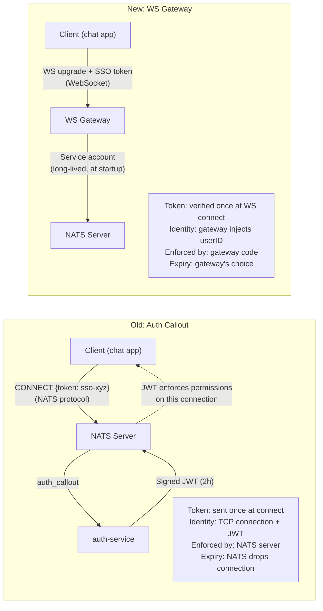
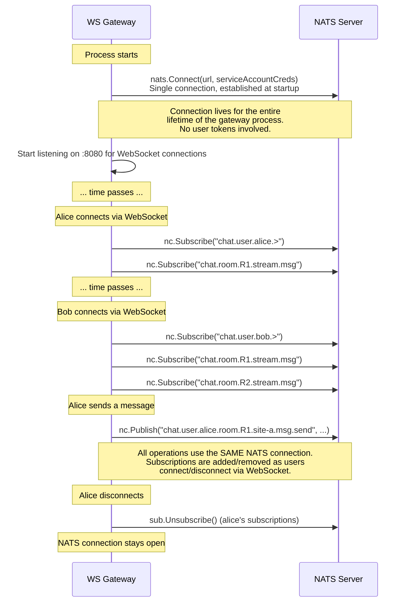
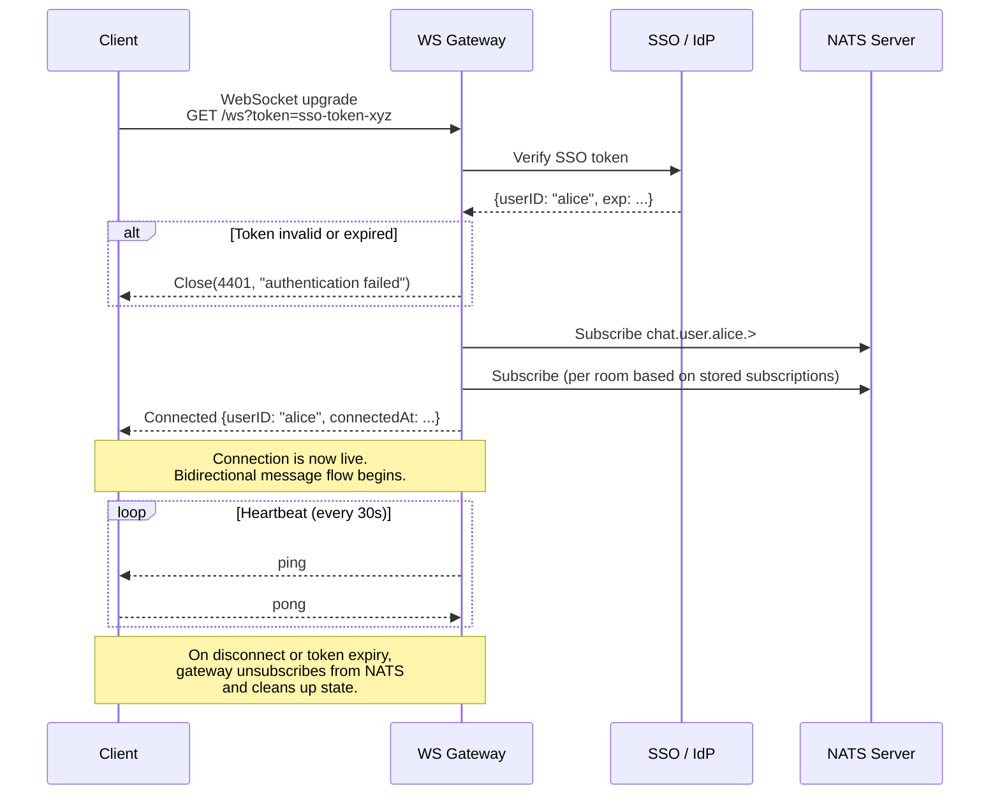
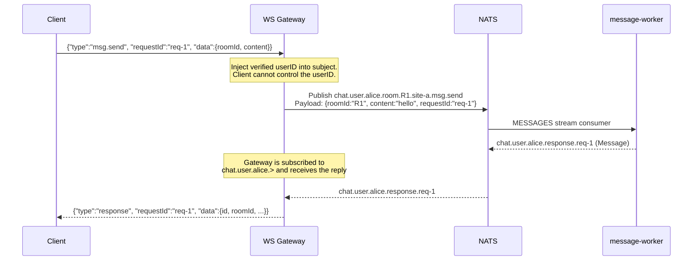
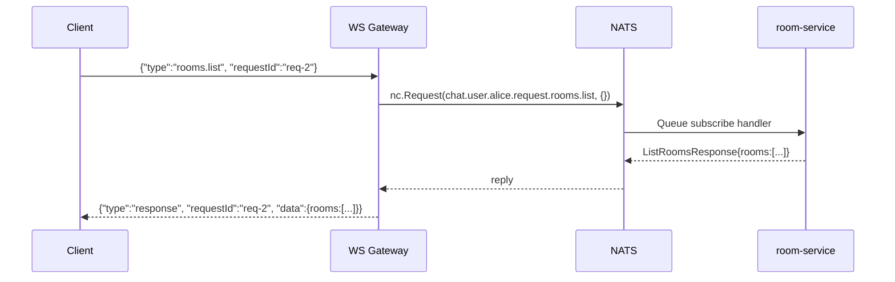
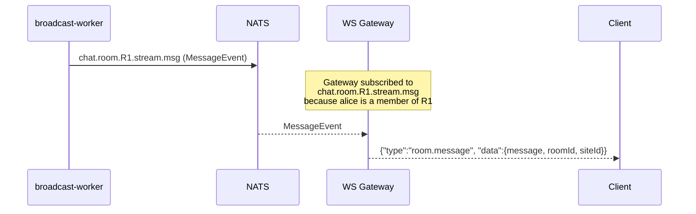
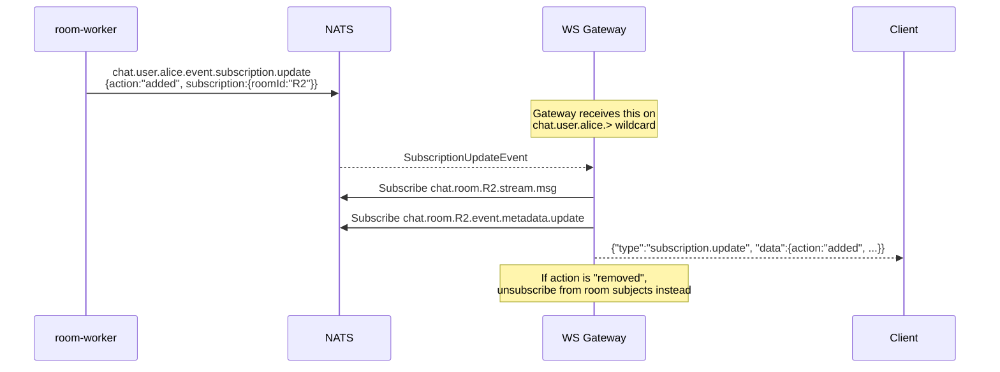

# WebSocket Gateway Architecture

Replaces NATS auth callout with a WebSocket gateway that sits between clients and NATS.
Clients connect via WebSocket. The gateway authenticates, enforces identity, and bridges
all communication to/from NATS. Backend services are unchanged.

## Overview

```
                    ┌──────────────────────────────────────────────┐
                    │                   Site A                     │
                    │                                              │
  Client ──WS──▶   │   WS Gateway ──NATS──▶  Backend Services    │
                    │       │                                      │
                    │   SSO/IdP verify                             │
                    │   Identity enforcement                       │
                    │   Subject mapping                            │
                    │   Subscription management                    │
                    │                                              │
                    └──────────────────────────────────────────────┘
```

**What changes:**
- auth-service is removed — gateway absorbs authentication
- Clients never connect to NATS directly
- Gateway is the only component that publishes on behalf of users

**What stays the same:**
- All 7 backend services (message-worker, broadcast-worker, notification-worker, room-service, room-worker, history-service, inbox-worker)
- All NATS subjects, streams, and payloads
- All MongoDB and Cassandra schemas
- Cross-site federation (OUTBOX/INBOX)

---

## Why Replace Auth Callout?

### The Token Expiry Problem

In the auth callout architecture, every client connects to NATS directly and receives
a scoped JWT (2h expiry). When the JWT expires, **NATS drops the connection**. The client
must reconnect with a fresh SSO token. With 10,000 users, that's 10,000 independent NATS
connections, each with its own expiry clock — creating constant reconnection churn.

Cross-site federation has a similar surface: if NATS-to-NATS server credentials expire
or are misconfigured, the JetStream source link breaks and federation stops.

### How the Gateway Solves This

The gateway connects to NATS **once at startup** using a service account — a long-lived
credential with no user-scoped expiry. This single connection is shared across all users
for the lifetime of the gateway process.

```
Old:  10,000 users = 10,000 NATS connections, each with a 2h JWT
      JWT expires → NATS drops connection → client must re-auth

New:  10,000 users = 10,000 WebSocket connections + 1 NATS connection (service account)
      Service account never expires → no reconnection churn
      User SSO expiry handled by gateway (force-disconnect WS or re-verify silently)
```

User token expiry is now the gateway's concern, not NATS infrastructure. The gateway
can choose how to handle it: force-disconnect the WebSocket, prompt re-auth over the
existing connection, or silently refresh if using OAuth2 refresh tokens.

### Side-by-Side Comparison



| Concern | Old (Auth Callout) | New (WS Gateway) |
|---------|-------------------|-------------------|
| Client protocol | NATS native (needs NATS client library) | WebSocket + JSON (works in any browser) |
| Auth token sent | Once, in NATS CONNECT handshake | Once, in WebSocket upgrade request |
| Identity enforced by | NATS server (JWT Pub.Allow/Sub.Allow) | Gateway (controls NATS subject, injects userID) |
| Token expiry | NATS drops TCP connection | Gateway decides: disconnect WS, re-verify, or refresh |
| NATS connections | 1 per user (each with scoped JWT) | 1 per gateway instance (service account, shared) |
| Cross-site auth | Server-level credentials (NKeys/creds) | Same — unchanged |
| Security boundary | Infrastructure (NATS enforces) | Application (gateway code enforces) |
| If auth component has a bug | NATS still enforces JWT permissions | Gateway could publish to any subject — single point of trust |

### NATS Connection Model



This is the same pattern every other service uses. For example, `message-worker/main.go:43`
calls `nats.Connect(cfg.NatsURL)` once at startup and uses that connection for the entire
process lifetime.

---

## Connection Lifecycle



### Initial Subscription Bootstrap

On successful auth, the gateway needs to know which rooms the user belongs to
so it can subscribe to the correct NATS subjects. Two approaches:

**Option A — Query MongoDB directly:**
Gateway reads the `subscriptions` collection for the user's rooms. Requires
gateway to have MongoDB access.

**Option B — Request via NATS:**
Gateway uses `nc.Request()` on `chat.user.{userID}.request.rooms.list` to get
rooms from room-service. No direct DB access needed. This is the preferred
approach since room-service already implements this.

After getting the room list, gateway subscribes to:
- `chat.user.{userID}.>` — personal namespace (DMs, notifications, events, responses)
- `chat.room.{roomID}.stream.msg` — per room (group message delivery)
- `chat.room.{roomID}.event.metadata.update` — per room (metadata changes)

---

## Client Protocol

All messages over the WebSocket are JSON frames with a `type` field.

### Client → Gateway (Actions)

```jsonc
// Send a message to a room
{
  "type": "msg.send",
  "requestId": "req-abc-123",
  "data": {
    "roomId": "room-1",
    "content": "hello world"
  }
}

// Create a room
{
  "type": "rooms.create",
  "requestId": "req-abc-124",
  "data": {
    "name": "general",
    "type": "group",
    "members": ["bob", "charlie"]
  }
}

// List rooms
{
  "type": "rooms.list",
  "requestId": "req-abc-125"
}

// Get a single room
{
  "type": "rooms.get",
  "requestId": "req-abc-126",
  "data": {
    "roomId": "room-1"
  }
}

// Invite a member
{
  "type": "member.invite",
  "requestId": "req-abc-127",
  "data": {
    "roomId": "room-1",
    "inviteeId": "bob"
  }
}

// Fetch message history
{
  "type": "msg.history",
  "requestId": "req-abc-128",
  "data": {
    "roomId": "room-1",
    "before": "2026-03-25T10:00:00Z",
    "limit": 50
  }
}
```

### Gateway → Client (Events)

```jsonc
// Response to a client action (keyed by requestId)
{
  "type": "response",
  "requestId": "req-abc-123",
  "data": { /* Message, Room, etc. */ }
}

// Response error
{
  "type": "error",
  "requestId": "req-abc-123",
  "error": {
    "code": "not_subscribed",
    "message": "you are not a member of this room"
  }
}

// New message in a room (from broadcast-worker)
{
  "type": "room.message",
  "data": {
    "message": { "id": "m1", "roomId": "room-1", "userId": "bob", "content": "hey", "createdAt": "..." },
    "roomId": "room-1",
    "siteId": "site-a"
  }
}

// Notification (from notification-worker)
{
  "type": "notification",
  "data": {
    "type": "new_message",
    "roomId": "room-1",
    "message": { ... }
  }
}

// Added or removed from a room
{
  "type": "subscription.update",
  "data": {
    "userId": "alice",
    "subscription": { "roomId": "room-1", "role": "member", ... },
    "action": "added"
  }
}

// Room metadata changed (name, user count, etc.)
{
  "type": "room.metadata.update",
  "data": {
    "roomId": "room-1",
    "name": "general",
    "userCount": 5,
    "lastMessageAt": "...",
    "updatedAt": "..."
  }
}
```

---

## Gateway Internal Flow

### Action: Send Message



### Action: Request/Reply (Rooms, History)



### Event: Real-Time Message Delivery



### Event: Dynamic Room Subscription

When the user is added to or removed from a room, the gateway must update its
NATS subscriptions dynamically.



---

## Subject Mapping Table

How gateway maps client action types to NATS subjects. The gateway controls
the `userID` segment — clients never specify it.

| Client Action Type | NATS Subject | Pattern |
|-------------------|-------------|---------|
| `msg.send` | `chat.user.{userID}.room.{roomID}.{siteID}.msg.send` | Publish (fire-and-forget, reply on response subject) |
| `rooms.create` | `chat.user.{userID}.request.rooms.create` | Request/Reply |
| `rooms.list` | `chat.user.{userID}.request.rooms.list` | Request/Reply |
| `rooms.get` | `chat.user.{userID}.request.rooms.get.{roomID}` | Request/Reply |
| `member.invite` | `chat.user.{userID}.request.room.{roomID}.{siteID}.member.invite` | Request/Reply |
| `msg.history` | `chat.user.{userID}.request.room.{roomID}.{siteID}.msg.history` | Request/Reply |

| NATS Subscription | Client Event Type | Source |
|-------------------|------------------|--------|
| `chat.user.{userID}.response.*` | `response` | message-worker reply |
| `chat.user.{userID}.stream.msg` | `room.message` | broadcast-worker (DM) |
| `chat.room.{roomID}.stream.msg` | `room.message` | broadcast-worker (group) |
| `chat.user.{userID}.notification` | `notification` | notification-worker |
| `chat.user.{userID}.event.subscription.update` | `subscription.update` | room-worker / inbox-worker |
| `chat.user.{userID}.event.room.metadata.update` | `room.metadata.update` | room-worker |
| `chat.room.{roomID}.event.metadata.update` | `room.metadata.update` | broadcast-worker |

---

## Gateway State Per Connection

Each WebSocket connection holds:

```
Connection {
    userID          string              // from verified SSO token
    siteID          string              // gateway's site
    wsConn          *websocket.Conn     // client WebSocket
    natsSubs        []*nats.Subscription // active NATS subscriptions
    rooms           map[string]bool     // rooms currently subscribed to
    connectedAt     time.Time
    tokenExpiresAt  time.Time           // force disconnect on expiry
}
```

**Memory estimate per connection:**
- WebSocket: ~4 KB (read/write buffers)
- NATS subscriptions: ~1 KB per subscription
- User in 20 rooms: ~24 KB total per connection
- 10K concurrent users: ~240 MB

---

## Gateway Configuration

```
WS_PORT              = 8080            # WebSocket listen port
NATS_URL             = nats://localhost:4222
SITE_ID              = site-a
SSO_JWKS_URL         = https://idp.example.com/.well-known/jwks.json  (or equivalent)
SSO_ISSUER           = https://idp.example.com
SSO_AUDIENCE         = chat-app
HEARTBEAT_INTERVAL   = 30s
TOKEN_EXPIRY_CHECK   = 60s            # how often to check for expired tokens
MAX_CONNECTIONS      = 10000
READ_BUFFER_SIZE     = 1024
WRITE_BUFFER_SIZE    = 1024
MAX_MESSAGE_SIZE     = 65536          # 64 KB max WS frame
REQUEST_TIMEOUT      = 5s            # timeout for NATS request/reply
```

---

## Scaling

### Horizontal Scaling

Multiple gateway instances behind a load balancer. Each instance is independent —
no shared state between instances.

```
                    ┌─── WS Gateway (instance 1) ───┐
Client A ──WS──▶   │   subscribed to alice's subjects │──── NATS
                    └───────────────────────────────────┘

                    ┌─── WS Gateway (instance 2) ───┐
Client B ──WS──▶   │   subscribed to bob's subjects   │──── NATS
                    └───────────────────────────────────┘
```

- Load balancer uses sticky sessions (IP hash or cookie) for WebSocket affinity
- Each gateway instance connects to NATS independently
- If an instance dies, clients reconnect to another instance and re-bootstrap subscriptions
- NATS handles fan-out — if alice is on instance 1 and bob is on instance 2,
  a message in their shared room is delivered to both instances via NATS pub/sub

### No Shared State Required

Gateway instances do not need to communicate with each other. Each instance:
- Manages its own WebSocket connections
- Has its own NATS subscriptions
- Bootstraps room list on connect via room-service

This avoids the need for Redis, shared session stores, or inter-gateway coordination.

---

## Graceful Shutdown

```
1. Stop accepting new WebSocket connections
2. Send close frame to all connected clients (code 1001, "going away")
3. Wait for in-flight NATS request/reply to complete (with timeout)
4. Unsubscribe all NATS subscriptions
5. Drain NATS connection
6. Close WebSocket listener
```

Shutdown timeout must be less than Kubernetes `terminationGracePeriodSeconds` (25s < 30s),
consistent with other services.

---

## Auth-Service Disposition

With the WebSocket gateway, auth-service is **no longer needed**. The gateway absorbs
its responsibilities:

| Responsibility | Before (auth-service) | After (WS gateway) |
|----------------|----------------------|---------------------|
| SSO token verification | auth-service via callout | Gateway on WS connect |
| User identity scoping | JWT `Pub.Allow` / `Sub.Allow` | Gateway controls NATS subject — userID injected server-side |
| Permission enforcement | NATS server applies JWT | Gateway only publishes to subjects the user is allowed |
| Token expiry | JWT `Expires` field (2h) | Gateway tracks `tokenExpiresAt`, force-disconnects on expiry |

The NATS server no longer needs auth_callout configured. The gateway connects
to NATS with a service account that has broad publish/subscribe permissions.
User-level isolation is enforced by the gateway code, not NATS permissions.

---

## What Does NOT Change

- **message-worker** — still consumes `MESSAGES` stream, still trusts `userID` in subject
- **broadcast-worker** — still consumes `FANOUT` stream, still publishes to room/user streams
- **notification-worker** — still consumes `FANOUT` stream, still publishes notifications
- **room-service** — still handles request/reply for room CRUD
- **room-worker** — still processes invites from `ROOMS` stream, still publishes to OUTBOX
- **history-service** — still handles request/reply for message history
- **inbox-worker** — still consumes `INBOX` stream for federation
- **All NATS subjects, streams, and consumer configurations**
- **All MongoDB and Cassandra schemas and queries**
- **Cross-site federation via OUTBOX/INBOX JetStream sourcing**
