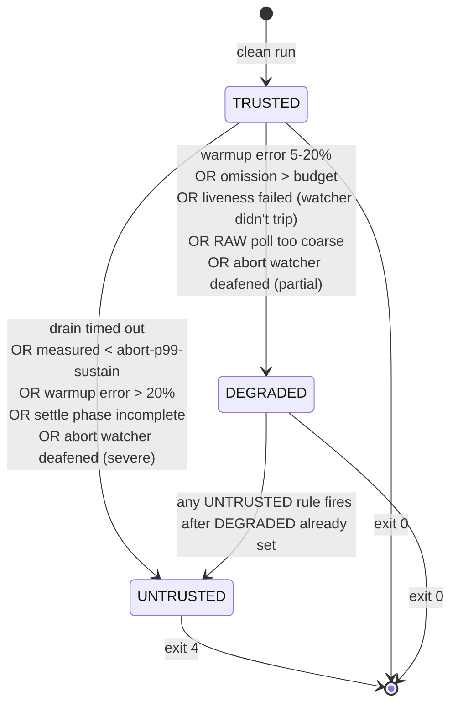
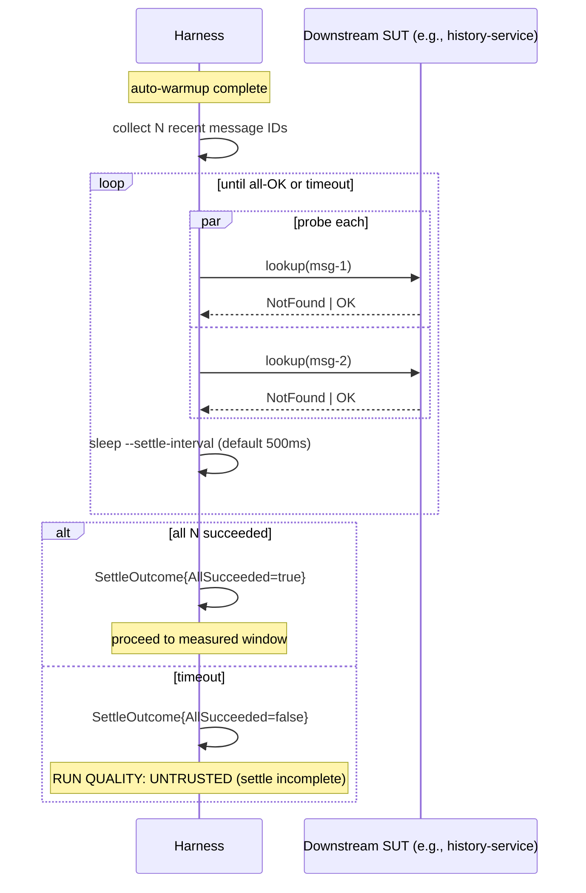

# loadgen Operator Guide

<!-- markdownlint-disable MD013 -->

## Table of Contents

1. [Prerequisites](#prerequisites)
2. [Concepts](#concepts)
3. [5-Minute Tour](#5-minute-tour)
4. [Recipes](#recipes)
5. [Pick a Scenario](#pick-a-scenario)
6. [Scenarios](#scenarios)
7. [Presets](#presets)
8. [Reading the Summary](#reading-the-summary)
9. [Tuning Knobs](#tuning-knobs)
10. [Live Dashboards + Alert Rules](#live-dashboards--alert-rules)
11. [Per-Script Reference](#per-script-reference)
12. [Migrating from v1](#migrating-from-v1)
13. [Pitfalls / Troubleshooting](#pitfalls--troubleshooting)
14. [Numbers You Can Defend / Numbers You Can't](#numbers-you-can-defend--numbers-you-cant)
15. [Glossary](#glossary)

---

## Prerequisites

- **Docker** (20.10+) and **Docker Compose** (v2 or `docker-compose` v1 — auto-detected by `scripts/lib/compose.sh`)
- **Go 1.25** (to build/run `loadgen`)
- **make** (for the repo's root Makefile targets)

Run `loadgen doctor` before every measurement session to confirm all host-readiness checks pass (Docker ping, NATS reachability, Mongo reachability, available file descriptors).

---

## Concepts

### HDR Histograms

Latency is tracked with HdrHistogram (high dynamic range). Unlike per-sample slices, HDR uses bounded memory regardless of throughput, making it suitable for sustained high-rate runs. Exported as `runs/<run_id>/histogram.bin`.

### Coordinated Omission

When the SUT is too slow to absorb the target rate, naively recording only completed requests underestimates the true latency. loadgen tracks the **dispatch deficit** — the gap between when a send was scheduled vs. when it was actually issued — and adds it back as virtual "omission samples". The corrected latency is the one that matters for capacity planning.

### Warmup vs. Measured

Every run has a **warmup** phase (default 10s, samples discarded) followed by the **measured** window (default 60s, samples counted). A **settle** phase between auto-warmup and measured waits for recent messages to become visible (read-after-write consistency probe), ensuring read scenarios start from a stable baseline.

### RUN QUALITY Verdict Tiers

| Verdict    | Meaning                                                                  | Exit code |
|------------|--------------------------------------------------------------------------|-----------|
| TRUSTED    | No quality issues detected. Numbers are defensible.                      | 0         |
| DEGRADED   | Minor quality issues (e.g. omission budget slightly exceeded). Use with care. | 0    |
| UNTRUSTED  | Critical quality issue. Numbers cannot be defended.                      | 4         |

See [docs/runbooks/loadgen-untrusted.md](docs/runbooks/loadgen-untrusted.md) for UNTRUSTED triage.

### Abort vs. Liveness

The **abort watcher** fires on p99 or error-rate breaches (configurable thresholds). The **liveness probe** fires when the SUT stops responding entirely. Both terminate the run early; exit codes differ (2 = abort, 3 = liveness).

### Settle Phase

After auto-warmup and before the measured window, loadgen polls `--settle-probes` recent message IDs to confirm they are visible. Timeout controlled by `--settle-timeout`. A settle failure → UNTRUSTED.

### Frontdoor vs. Canonical

`--inject=frontdoor` (default) publishes via the normal MESSAGES JetStream subject — exercises the full pipeline (gatekeeper, worker). `--inject=canonical` bypasses gatekeeper and publishes directly to MESSAGES_CANONICAL — useful for isolating downstream workers.

### RUN QUALITY verdict state diagram

The verdict accumulates evidence across the run. Each rule contributes to either the UNTRUSTED tier (numbers cannot be defended) or the DEGRADED tier (numbers can be reported with caveats). The final verdict is the highest tier triggered.



A verdict can only be reached once per run (terminal). The Issues list includes ALL fired rules — even DEGRADED-tier issues are listed in an UNTRUSTED verdict for visibility.

### Settle phase sequence

When `--settle-probes > 0`, the harness pauses between auto-warmup and the measured window to verify N recent message-IDs are visible in the downstream system.



---

## 5-Minute Tour

```bash
# 1. Start the SUT stack.
./tools/loadgen/scripts/up.sh

# 2. Run a quick baseline.
./tools/loadgen/scripts/quickstart.sh

# 3. Read the summary printed to stdout.
#    Look for: RUN QUALITY: TRUSTED, p99 latency, omission deficit.

# 4. Tear down.
./tools/loadgen/scripts/down.sh
```

The `quickstart.sh` script runs `messaging-pipeline` at 200 rps for 60s with the `small` preset. It is not a capacity-baseline; use the Recipes below for measurement workflows.

---

## Recipes

### Recipe: Capacity-baseline a single change

Goal: detect whether a code change moved p99 latency at 500 rps.

```bash
# 1. Capture baseline on main.
loadgen recommend --target-rps=500 --duration=5m
# note the suggested flags

git checkout main
./tools/loadgen/scripts/up.sh
loadgen run --scenario=messaging-pipeline --preset=medium --rate=500 \
    --duration=5m --warmup=15s
# saves runs/<old_run_id>/

# 2. Apply your change and capture a second run.
git checkout my-branch
loadgen run --scenario=messaging-pipeline --preset=medium --rate=500 \
    --duration=5m --warmup=15s
# saves runs/<new_run_id>/

# 3. Compare.
./tools/loadgen/scripts/compare-runs.sh <old_run_id> <new_run_id>
```

Both runs must show `RUN QUALITY: TRUSTED`. If either is DEGRADED or UNTRUSTED, the numbers cannot be defended — see [Pitfalls](#pitfalls--troubleshooting).

### Recipe: Soak test (overnight)

Goal: expose memory leaks and slow degradation over several hours.

```bash
./tools/loadgen/scripts/up.sh
./tools/loadgen/scripts/run-soak.sh --rate=300 --duration=4h --preset=realistic
# produces runs/<run_id>/ with per-minute timeseries
```

Open the Grafana overview dashboard (`:3000/d/loadgen-overview`) to watch for gradual p99 creep or Mongo working-set growth.

### Recipe: Chaos injection

Goal: verify the SUT recovers within SLA when a downstream dep flaps.

```bash
./tools/loadgen/scripts/up.sh
./tools/loadgen/scripts/run-chaos.sh --scenario=messaging-pipeline \
    --rate=500 --duration=5m --chaos=mongo-latency:200ms
# Uses toxiproxy to inject 200ms Mongo read latency mid-run.
```

Expected: p99 rises during chaos window; recovers within ~30s of removal. Check `runs/<run_id>/summary.json` for the abort-watcher verdict.

### Recipe: Federation lag measurement

Goal: measure cross-site message delivery lag (OUTBOX→INBOX round-trip).

```bash
# Requires the federation Compose overlay (site-a + site-b NATS).
cd tools/loadgen/deploy && \
    docker compose -f docker-compose.yml -f docker-compose.federation.yml \
                   --profile federation up -d
loadgen run --scenario=federation-lag \
    --preset=messaging-pipeline \
    --rate=200 --duration=5m \
    --federation-secondary-nats-url=nats://site-b-nats:4222
# Summary shows federation_p50, federation_p99 under "Federation lag".
```

See [docs/scenarios/federation-lag.md](docs/scenarios/federation-lag.md) for flap-testing.

### Recipe: RAW (read-after-write) timing

Goal: measure how quickly a published message becomes visible via the history API.

```bash
loadgen run --scenario=raw-consistency \
    --preset=small \
    --rate=50 --duration=3m \
    --raw-poll-interval=10ms --raw-timeout=5s
```

Interpret results: `raw_p50`, `raw_p99` in summary. If `raw_p99 > raw-timeout`, the scenario records "not-visible" outcomes — see [Pitfalls → raw-poll-bias](#raw-poll-bias).

### Recipe: Author a new scenario

```bash
./tools/loadgen/scripts/new-scenario.sh my-scenario
# Creates scenario_myscenario.go with stub + test.
# Edit: implement Run(ctx, deps) and register via init().
loadgen scenarios   # confirm it appears
loadgen run --scenario=my-scenario --preset=small --rate=10 --duration=30s
```

---

## Pick a Scenario

```
What do you want to measure?
│
├─ End-to-end publish latency (frontdoor → broadcast → receipt)
│     → messaging-pipeline
│
├─ Cassandra history query latency
│     → history-read
│
├─ Search query latency
│     → search-read
│
├─ Room CRUD RPC latency (create/invite/leave)
│     → room-rpc
│
├─ Read-after-write consistency window
│     → raw-consistency
│
├─ Large-room broadcast fan-out
│     → large-room-broadcast
│
├─ Notification delivery to offline users
│     → notification-fanout  (in-app channel; push/email gated on notif_routing_ready)
│
├─ Message edit/delete throughput
│     → message-mutate
│
├─ Subscription create/delete churn
│     → subscription-churn
│
├─ First-DM room provisioning
│     → first-dm
│
├─ Auth reconnect storms
│     → auth-load
│
├─ Cross-site federation INBOX drain
│     → federation-lag
│
├─ Read-receipt delivery coverage
│     → read-receipts
│
└─ Room creation throughput
      → room-open
```

---

## Scenarios

### messaging-pipeline

Default scenario. Publishes messages to the MESSAGES stream (frontdoor) or MESSAGES_CANONICAL (canonical inject). Measures end-to-end latency from publish to broadcast receipt.

Flags: `--rate`, `--inject`, `--preset`. Deep dive: *(no separate doc — baseline scenario)*.

### history-read

Reads from the Cassandra history API at the configured rate. Requires messages seeded during auto-warmup. Measures read latency percentiles.

Flags: `--rate`, `--request-timeout`. Default preset: `history-read`.

### search-read

Issues search queries against the search service at the configured rate. Measures query latency.

Flags: `--rate`, `--request-timeout`. Default preset: `search-read`.

### room-rpc

Creates, invites to, and leaves rooms via NATS request/reply RPCs. Measures RPC latency.

Flags: `--rate`, `--request-timeout`. Default preset: `room-rpc`.

### raw-consistency

Publishes a message, then polls the history API until it is visible (or times out). Measures the read-after-write visibility window.

Flags: `--raw-poll-interval`, `--raw-timeout`. See [Pitfalls → raw-poll-bias](#raw-poll-bias).

### search-sync-lag

Publishes a canonical `MessageEvent` carrying a unique searchable token, then polls `search.messages` until that doc surfaces. Records `loadgen_search_index_lag_seconds` (publish → first search hit) and `loadgen_search_index_visible_total{outcome=...}` (terminal counts).

The measured lag is dominated by ES's `refresh_interval` (default `30s` on the `messageCollection` index template in `search-sync-worker/messages.go`). Lowering it is a SUT-side decision, not loadgen's.

Required flags:

- `--inject=canonical` — the scenario publishes to `MESSAGES_CANONICAL_{siteID}`; with the default `frontdoor` mode the publish dead-letters and zero observations land. `NewGenerator` refuses the run with a clear error in that case.

Scenario-specific flags:

- `--search-sync-poll-interval` (default `250ms`) — interval between `search.messages` polls. Polling much faster than ES refreshes wastes RPCs without resolving the lag better.
- `--search-sync-timeout` (default `90s`) — per-message poll deadline. ~3× the default refresh covers the long tail (compaction, GC pauses, bulk-flush slack).
- `--search-sync-acl-wait` (default `35s`) — one-shot wait after the user-room ACL bootstrap, before the per-tick publish/poll loop starts. Covers ES `refresh_interval` plus bulk-flush slack so the very first search request actually has the ACL doc to terms-lookup against.
- `--search-sync-skip-acl-bootstrap` (default off) — skip the bootstrap publishes AND the `--search-sync-acl-wait` entirely. Safe to set when the ACL doc has already been seeded via `loadgen seed --with-search-sync-acl` (see the recommended workflow below), or when iterating fast against a warm cluster where the user-room ACL doc is already populated from a prior run.
- `--max-in-flight=N` (overrides the `MAX_IN_FLIGHT` env var when set > 0) — caps concurrent in-flight pollers. Lower it when the dashboard shows `dropped_inflight` dominance; raise it when the SUT has headroom but rate × timeout exceeds 200.

**Recommended workflow (seed-time ACL).** The ACL bootstrap adds ~35 s of dead time to every Run by default. To pay that wait only once per seed:

```bash
# One-time: provision Mongo fixtures AND publish the ACL events + wait for ES.
loadgen seed --preset=search-read --with-search-sync-acl

# Subsequent runs skip the redundant Run-time bootstrap — start measuring immediately.
loadgen run --scenario=search-sync-lag --inject=canonical --preset=search-read \
            --search-sync-skip-acl-bootstrap
```

`--with-search-sync-acl` connects to NATS, publishes one synthetic `OutboxMemberAdded` per unique `(account, roomID)` fixture tuple, then blocks for `--search-sync-acl-wait` (default `35s`) so the ES `refresh_interval` has time to expose the `user-room` docs. It is OFF by default so the common messages-workload `loadgen seed` stays Mongo-only and doesn't require NATS connectivity. Re-seeding is idempotent — search-sync-worker's painless LWW treats redundant writes with equal timestamps as no-ops.

If you skip the seed-time flag, the Run-time bootstrap is unchanged: every `loadgen run --scenario=search-sync-lag` still pays the 35 s wait at start. Old workflows keep working.

Triage with the outcome counter — `loadgen_search_index_visible_total{outcome}`:

- `visible` — happy path; corresponding lag samples are in the histogram.
- `timeout` — poll deadline hit. Raise `--search-sync-timeout`, or look at ES and search-sync-worker — refresh interval misconfigured, sync-worker behind, or ACL bootstrap missed.
- `transport_error` — NATS request itself failed. search-service down or NATS partitioned.
- `publish_error` — canonical publish failed. JetStream not configured (verify `--inject=canonical` and that `MESSAGES_CANONICAL_{siteID}` exists).
- `dropped_inflight` — concurrent-poll cap (`MaxInFlight`) was full; the poll was skipped instead of amplifying open-loop pressure on search-service. If you see these consistently the SUT is slower than the scenario rate × timeout product can absorb. Lower `--rate`, raise `--max-in-flight`, or shorten `--search-sync-timeout`.
- `bootstrap_error` — the ACL bootstrap publishes themselves failed (e.g., NATS unreachable). Fires once per failed run. Disambiguates "scenario never ran" from "scenario ran with zero observations" on a silent dashboard.

**Sizing the run.** The in-flight poll count grows as `rate × timeout` until either visibility or timeout. With defaults (`MaxInFlight=200`, `--search-sync-timeout=90s`), sustaining `dropped_inflight=0` requires `rate ≲ 2/s`. The default `--rate=500` is intended for the high-volume `messaging-pipeline`; for search-sync-lag start at `--rate=1` and raise gradually while watching the `dropped_inflight` counter. Run for longer (`--duration=10m+`) rather than faster — ES refresh dominates the signal and short runs don't fill the histogram.

**ACL precondition.** `search-service/query_messages.go` AND's the caller's `roomIds` filter with a terms-lookup against the per-user `user-room` ES doc. That doc is written exclusively by search-sync-worker's `user-room-sync` consumer on `OutboxMemberAdded`/`OutboxMemberRemoved` events on the local INBOX stream. Mongo seeding doesn't touch ES, so the scenario publishes one synthetic `member_added` `OutboxEvent` per unique `(account, roomID)` fixture tuple onto `chat.inbox.{siteID}.member_added` at `Run` start, then waits `--search-sync-acl-wait` before driving traffic.

### large-room-broadcast

Sends to rooms with hundreds–thousands of members. Measures fan-out latency and broadcast worker throughput.

Presets: `announce-room`, `firehose-room`, `bot-room`.

### notification-fanout

**Status: IMPLEMENTED (in-app channel).** The scenario subscribes to
`subject.Notification(account)` for every unique fixture account, publishes
user messages at the configured rate, and records publish→notification lag
into `loadgen_notification_lag_seconds{channel="inapp"}`. Each publish fans
out to N recipients (everyone in the room except the sender), so each
recipient's notification yields a separate lag observation — histogram
cardinality is N × tick-count.

The push/email channels remain gated on the `notif_routing_ready` build tag
until `pkg/subject` exposes per-channel routing builders. See
[docs/scenarios/notification-fanout.md](docs/scenarios/notification-fanout.md)
for the SUT subject contract and §3.4b activation playbook.

Publishes messages and measures notification delivery latency per recipient.

Deep dive: [docs/scenarios/notification-fanout.md](docs/scenarios/notification-fanout.md).

### message-mutate

Issues edit and delete operations against recent messages. Flags: `--mutate-rate`, `--edit-age-distribution`.

### subscription-churn

Rapidly creates and deletes subscriptions. Flags: `--churn-rate`.

### first-dm

Provisions new DM room pairs end-to-end and measures four sub-stage lags (`room`, `subs`, `persist`, `e2e`) into `loadgen_first_dm_lag_seconds{stage}` by issuing real RoomCreate requests against room-service and publishing a synthetic DM canonical message per iteration. Pool exhausts cleanly after one pass; `--first-dm-recycle` wraps but logs a warning because recycled pairs hit room-service's existing-DM branch instead of the create path. Flags: `--first-dm-recycle`. Seed-time: `--include-first-dm-fixtures --first-dm-pairs=N`.

Deep dive: [docs/scenarios/first-dm.md](docs/scenarios/first-dm.md).

### auth-load

Benchmarks `auth-service` under two workloads selected by preset:

- **Normal mode** (any preset other than `auth-reconnect-storm`): HTTP tick loop at `--rate` rps alternating `POST /auth` (login) and `GET /healthz` (validate). Observed into `loadgen_requests_total{kind=login|validate}` + `loadgen_request_latency_seconds`. Requires auth-service running in `DEV_MODE=true`.
- **Reconnect-storm mode** (preset `auth-reconnect-storm`): dials `AuthIdleConnections` NATS connections (1000 by default), drops them all, immediately re-dials, and observes time-to-recovery into `loadgen_auth_reconnect_seconds` + `loadgen_auth_reconnects_completed_total`. First event fires at T+30s; `--auth-storm-period > 0` enables a periodic loop.

Flags: `--auth-storm-period`, `--auth-url` (or `AUTH_SERVICE_URL` env).

Deep dive: [docs/scenarios/auth-load.md](docs/scenarios/auth-load.md).

### federation-lag

Publishes on site-a and measures lag until messages are visible on site-b via INBOX. Flags: `--federation-flap`, `--federation-cross-read`, `--federation-secondary-nats-url`, `--flap-period`, `--flap-down`.

Deep dive: [docs/scenarios/federation-lag.md](docs/scenarios/federation-lag.md).

### read-receipts

Fires MessageRead events for a fraction of recipients after each publish. Flags: `--receipt-coverage`.

### room-open

Benchmarks the room-open (create channel room) RPC throughput.

### presence-typing (stub — deferred)

Measures presence/typing indicator delivery. Gated on `presence_ready` build tag. See [docs/scenarios/presence-typing.md](docs/scenarios/presence-typing.md).

---

## Presets

| Name                 | Users  | Rooms | Description                                        |
|----------------------|--------|-------|----------------------------------------------------|
| `small`              | small  | few   | Minimal smoke-test footprint                        |
| `medium`             | medium | mid   | Typical CI-friendly footprint                       |
| `large`              | large  | many  | Heavy load shape                                    |
| `messaging-pipeline` | broad  | broad | Default broad-spectrum write load                   |
| `realistic`          | broad  | broad | Balanced traffic shape (60% DM, 40% channel)        |
| `channel-heavy`      | broad  | broad | Team-channel-dominated workplace shape              |
| `dm-heavy`           | broad  | broad | DM-dominated consumer shape                         |
| `history-read`       | 10     | 5     | History-service read benchmark                      |
| `search-read`        | 10     | 5     | Search-service query benchmark                      |
| `room-rpc`           | 1000   | 100   | Room RPC benchmark                                  |
| `announce-room`      | 10000  | 1     | 10k members, 1 broadcast/min (large-room)           |
| `firehose-room`      | 1000   | 1     | 1k members, 50 writes/sec (large-room)              |
| `bot-room`           | 100    | 1     | 100 members, 200 writes/sec from 3 bots             |
| `incident-burst`     | broad  | broad | 5 rps baseline with 200 rps bursts every 30s        |
| `auth-reconnect-storm` | 1000 | -   | 1k idle conns dropped at T+30s (auth-load)          |

---

## Reading the Summary

```
=== loadgen run summary ===
RUN QUALITY: TRUSTED
Run ID:      01970a4f-8c2d-7c9a-abcd-e0123456789f
Scenario:    messaging-pipeline
Preset:      medium
Rate:        500 rps (target)  498.3 rps (actual)
Duration:    5m0s (measured)   15s (warmup)

--- Latency (publish → receipt, measured window) ---
  p50:   12ms    p95:   45ms    p99:   88ms    max:  312ms
  omission p50:   0ms   omission p99:   2ms    budget: 50ms  ✓

--- Published / Queued / Acked ---
  published:  149,490   queued:  149,490   acked: 149,488
  errors:           2   (0.001%)

--- Abort watcher ---
  window: 30s  cap: 30,000 samples  utilisation: 49.9%  ✓

--- Settle phase ---
  probes: 20/20  ✓
```

Key fields:

- **RUN QUALITY** — top-level verdict. TRUSTED = numbers are defensible.
- **actual rps** — if actual < 95% of target, the generator itself is the bottleneck (`--connections` may help).
- **omission p99** — coordinated-omission-corrected p99. If >> raw p99, the SUT is queueing load.
- **budget** — set via `--abort-on-p99-ms`. `✓` = no breach.
- **queued vs acked** — `queued - acked` = async publishes still in flight at summary time. Should be near zero.
- **abort watcher utilisation** — if > 100%, the watcher was deafened; see [abort-watcher-deafened](#abort-watcher-deafened).

---

## Tuning Knobs

### Rate and shape

| Flag | Default | Notes |
|------|---------|-------|
| `--rate` | 500 | Target msgs/sec |
| `--ramp-from`, `--ramp-to`, `--ramp-duration` | 0 (disabled) | Linear or exponential ramp |
| `--ramp-shape` | `linear` | `linear\|exponential` |
| `--connections` | 1 | NATS data connections; increase for >1k rps fan-out |
| `--inject` | `frontdoor` | `frontdoor\|canonical` |

### Duration and warmup

| Flag | Default | Notes |
|------|---------|-------|
| `--duration` | 60s | Measured window length |
| `--warmup` | 10s | Warmup period (samples discarded) |
| `--auto-warmup` | true | Pre-run auto-warmup for read scenarios |
| `--auto-warmup-rate` | 200 | rps during auto-warmup |
| `--settle-probes` | 20 | Messages to probe in settle phase; 0 disables |
| `--settle-timeout` | 30s | Max wait for settle to complete |
| `--settle-interval` | 500ms | Poll interval during settle |

### Abort watcher

| Flag | Default | Notes |
|------|---------|-------|
| `--abort-on-p99-ms` | 0 (disabled) | Abort if p99 stays over this for `--abort-p99-sustain` |
| `--abort-p99-sustain` | 30s | Sustain window for p99 abort |
| `--abort-on-error-pct` | 0 (disabled) | Abort if error fraction stays over this |
| `--abort-error-sustain` | 10s | Sustain window for error-rate abort |
| `--abort-window-max-samples` | 10000 | Ring-buffer cap. Size to ≥ `peak_rps × max_sustain` or the watcher is deafened. |

### Liveness probe

| Flag | Default | Notes |
|------|---------|-------|
| `--liveness-interval` | 10s | SUT probe interval; 0 disables |
| `--liveness-failures` | 3 | Consecutive failures to trigger abort |
| `--liveness-timeout` | 5s | Per-probe timeout |

### Run isolation

| Flag | Default | Notes |
|------|---------|-------|
| `--allow-concurrent` | false | Allow multiple concurrent runs against the same SUT |
| `--run-ttl` | 2h | Age at which a stale run lock is considered orphaned |

### JetStream

| Flag | Default | Notes |
|------|---------|-------|
| `--js-async-max-pending` | 4096 | Max in-flight async JetStream publishes; 0 = sync (legacy) |

### Scenario-specific

| Flag | Scenario | Default | Notes |
|------|----------|---------|-------|
| `--request-timeout` | read scenarios | 5s | Per-request deadline |
| `--raw-poll-interval` | raw-consistency | 10ms | Poll interval for visibility probe |
| `--raw-timeout` | raw-consistency | 5s | Per-message visibility timeout |
| `--search-sync-poll-interval` | search-sync-lag | 250ms | Poll interval for `search.messages` visibility |
| `--search-sync-timeout` | search-sync-lag | 90s | Per-message poll timeout (≈ 3× ES refresh_interval) |
| `--search-sync-acl-wait` | search-sync-lag | 35s | One-shot wait after ACL bootstrap before the publish/poll loop starts. Also used by `loadgen seed --with-search-sync-acl` for the post-publish wait. |
| `--search-sync-skip-acl-bootstrap` | search-sync-lag | false | Skip Run-time bootstrap + ACL wait (set when the ACL was already seeded via `loadgen seed --with-search-sync-acl`, or when iterating against a warm cluster) |
| `--with-search-sync-acl` | `loadgen seed` | false | Publish the user-room ACL bootstrap events to NATS and wait for ES refresh as part of seeding. Pair with `loadgen run --search-sync-skip-acl-bootstrap` to avoid the 35 s wait on every run. |
| `--max-in-flight` | run, members-sustained, members-capacity | 0 (env) | Override `MAX_IN_FLIGHT` env when > 0; caps concurrent publishers/pollers |
| `--receipt-coverage` | read-receipts | 0.6 | Fraction of recipients to fire MessageRead for |
| `--mutate-rate` | message-mutate | 5 | Mutations/sec |
| `--edit-age-distribution` | message-mutate | `0.7,0.3` | Typo vs correction age fractions |
| `--churn-rate` | subscription-churn | 5 | Churn events/sec |
| `--first-dm-recycle` | first-dm | false | Wrap around user-pair pool when exhausted |
| `--auth-storm-period` | auth-load | 0 | Interval between reconnect storms; 0 = one-shot at T+30s |
| `--auth-url` | auth-load | `http://auth-service:8080` | auth-service base URL (overrides `AUTH_SERVICE_URL` env) |
| `--federation-flap` | federation-lag | false | Enable periodic site-b stop/restart |
| `--federation-cross-read` | federation-lag | false | Enable cross-site history read sub-mode |
| `--federation-secondary-nats-url` | federation-lag | "" | NATS URL for site-b |
| `--flap-period` | federation-lag | 60s | Interval between flap events |
| `--flap-down` | federation-lag | 30s | Site-b downtime per flap |

### Environment variables

These settings have no CLI flag equivalent. Set them in the shell before invoking `loadgen`.

| Variable | Default | Notes |
|----------|---------|-------|
| `RUNS_DIR` | `runs/` | Directory where per-run artifact bundles (`summary.json`, `histogram.bin`, etc.) are written. |
| `FEDERATION_SECONDARY_NATS_URL` | `""` | NATS URL for site-b used by the `federation-lag` scenario when the `--federation-secondary-nats-url` flag is not passed. |
| `TOXIPROXY_URL` | `http://localhost:8474` | Toxiproxy admin endpoint for the `loadgen chaos` subcommand. |

### Use `loadgen recommend`

```bash
loadgen recommend --target-rps=500 --duration=5m
```

Prints a suggested flag set including `--abort-window-max-samples` sized to `2 × 500 × 30 = 30000`.

---

## Live Dashboards + Alert Rules

Dashboards are in `deploy/grafana/dashboards/v2/`. Enable with the `dashboards` Compose profile:

```bash
./tools/loadgen/scripts/run-dashboards.sh
# Opens Grafana at http://localhost:3000 (admin/admin)
```

Dashboards:

| Dashboard | URL path | Covers |
|-----------|----------|--------|
| Overview | `/d/loadgen-overview` | RUN QUALITY, p99, omission, publish throughput |
| RAW timing | `/d/loadgen-raw` | Read-after-write visibility latency distribution |
| Federation | `/d/loadgen-federation` | Cross-site lag p50/p99, INBOX backlog |
| System | `/d/loadgen-system` | Host CPU, memory, cAdvisor container stats |

Alert rules are in `deploy/prometheus/rules/loadgen.yml`. Five alerts are defined:

1. `LoadgenUntrustedRunActive` — any run with verdict=UNTRUSTED → see [untrusted-run](#untrusted-run)
2. `LoadgenOmissionBudgetExceeded` — omission > 25% of measured latency → see [omission-budget](#omission-budget)
3. `LoadgenAsyncAckBacklog` — async-ack errors >1/s for 5m → see [async-ack-backlog](#async-ack-backlog)
4. `LoadgenRAWHistoryP99High` — RAW visibility lag degraded → see [raw-poll-bias](#raw-poll-bias)
5. `LoadgenSelfSaturation` — tick loop dropping >1 send/s → see [self-saturation](#self-saturation)

---

## Per-Script Reference

| Script | Purpose |
|--------|---------|
| `up.sh` | Start the full SUT Compose stack |
| `down.sh` | Tear down the SUT stack |
| `quickstart.sh` | One-command smoke run (small preset, 200 rps, 60s) |
| `run-soak.sh` | Long-duration soak with per-minute timeseries |
| `run-campaign.sh` | Multi-scenario campaign run with artifact collection |
| `run-chaos.sh` | Chaos overlay via toxiproxy |
| `run-canonical.sh` | Canonical-inject run (bypasses gatekeeper) |
| `run-ramp.sh` | Ramped rate run (linear or exponential) |
| `run-realistic.sh` | Realistic traffic shape (60% DM, 40% channel) |
| `run-mixed.sh` | Mixed scenario batch run |
| `run-saturation.sh` | Saturation ramp — finds the cliff |
| `compare-runs.sh` | Diff two run artifact bundles (p99, omission, errors) |
| `triage.sh` | Collect diagnostic data for a failing run |
| `bisect.sh` | Git-bisect driver — runs loadgen at each commit |
| `preflight.sh` | Host readiness checks (same as `loadgen doctor`) |
| `new-scenario.sh` | Scaffold a new scenario file + test |

Run any script with `--help` for flag details.

---

## Migrating from v1

### Flag changes

| Old (v1) | New (v2) | Notes |
|----------|----------|-------|
| `--abort-window-max-samples=10000` (fixed) | `--abort-window-max-samples` with auto-size via `loadgen recommend` | Default no longer deafens watcher at common rates |
| *(none)* | `--settle-timeout`, `--settle-interval`, `--settle-probes` | New settle phase |
| *(none)* | `--allow-concurrent`, `--run-ttl` | Run isolation |
| *(none)* | `--raw-poll-interval`, `--raw-timeout` | RAW timing scenario |
| *(none)* | `--receipt-coverage` | Read-receipts scenario |
| *(none)* | `--mutate-rate`, `--edit-age-distribution` | Message-mutate scenario |
| *(none)* | `--churn-rate` | Subscription-churn |
| *(none)* | `--first-dm-recycle` | First-DM scenario |
| *(none)* | `--federation-flap`, `--federation-cross-read`, `--flap-period`, `--flap-down`, `--federation-secondary-nats-url` | Federation-lag scenario |
| *(none)* | `--auth-storm-period` | Auth-load reconnect storm |

### Summary layout changes

v2 adds to the top of every summary:

```
RUN QUALITY: TRUSTED|DEGRADED|UNTRUSTED
```

Scripts that parse summary output by line offset must be updated.

### Dashboard-breaking label changes

`loadgen_publish_errors_total` and `loadgen_request_errors_total` now carry a `phase={warmup,measured}` label. Existing dashboards that sum these counters should aggregate across `phase=` (summing implicitly is fine; filtering to `{phase="measured"}` is the common new usage). See [CHANGES.md → Dashboard-breaking changes](CHANGES.md#dashboard-breaking-changes).

---

## Pitfalls / Troubleshooting

### untrusted-run

`RUN QUALITY: UNTRUSTED` means one or more critical quality checks failed. Numbers from this run cannot be used for capacity decisions. See [docs/runbooks/loadgen-untrusted.md](docs/runbooks/loadgen-untrusted.md) for full triage steps.

Quick check: `cat runs/<run_id>/summary.json | jq '.issues'`

### drain-timeout

```
async drain timed out → see USAGE.md#drain-timeout
```

The harness publishes asynchronously. After the measured window ended, it waited up to `--async-drain-timeout` for all pending JetStream acks — and the timer expired with acks outstanding.

Fix: increase `--async-drain-timeout`, or reduce `--rate` to fit the SUT's actual capacity.

### measured-too-short

```
measured window Xs shorter than abort-p99-sustain Ys → see USAGE.md#measured-too-short
```

The measured window must be longer than `--abort-p99-sustain` so the abort watcher has enough samples to fire.

Fix: increase `--duration`, or decrease `--abort-p99-sustain`.

### warmup-errors

```
warmup error rate N% > 20% → see USAGE.md#warmup-errors
```

More than 20% of warmup publishes errored. Either the SUT is unhealthy, or the preset is too aggressive.

Fix: run `loadgen doctor`; try `--preset=small`; inspect SUT logs.

### settle-incomplete

```
settle phase incomplete: N/M probes succeeded → see USAGE.md#settle-incomplete
```

The settle phase timed out before all visibility probes succeeded. The SUT's read-after-write consistency is degraded or the settle timeout is too short.

Fix: increase `--settle-timeout`; if the SUT is genuinely inconsistent, consider `raw-consistency` as the measurement target instead.

### omission-budget

```
omission p99 Xms exceeds budget Yms → see USAGE.md#omission-budget
```

The coordinated-omission-corrected p99 exceeds the configured budget. This means the generator was queueing load — the SUT is undersized for the requested rate.

Fix: reduce `--rate`, or accept that capacity at this rate is insufficient.

### abort-watcher-deafened

```
abort watcher deafened by sample cap (ratio >2×) → see USAGE.md#abort-watcher-deafened
```

The abort watcher's rolling window cap is too small. Samples roll out before the sustain window elapses, so the abort condition can never be observed.

Fix: use `loadgen recommend --target-rps=N --duration=...` to compute `--abort-window-max-samples = 2 × peak_rps × max_sustain`.

### async-ack-backlog

Alert: `LoadgenAsyncAckBacklog` — async JetStream ack-failure rate >1/s for 5m.

JetStream is failing to acknowledge published messages. Check JetStream consumer lag on the MESSAGES or MESSAGES_CANONICAL stream. Possible causes: JetStream disk full, stream retention limit hit, NATS broker overloaded.

Fix: drain the stream (`nats stream purge`), increase retention, or reduce `--js-async-max-pending`.

### raw-poll-bias

Alert: `LoadgenRAWHistoryP99High` / warning in summary.

```
RAW poll-interval too coarse vs measured p50 → see USAGE.md#raw-poll-bias
```

The `--raw-poll-interval` is coarser than the actual RAW p50. Polling introduces a systematic upward bias: if `poll_interval = 100ms` and `actual_visibility = 5ms`, measured p50 will be ~50ms. Use a poll interval ≤ 10% of the expected visibility time.

Fix: decrease `--raw-poll-interval` (default 10ms is usually fine for fast SUTs).

### self-saturation

Alert: `LoadgenSelfSaturation` — tick loop dropping >1 send/s.

The generator cannot keep up with the requested `--rate`. This is a generator-side problem, not a SUT problem. Numbers are unreliable.

Fix: reduce `--rate`, increase `--connections`, or run on a host with more available CPU.

---

## Numbers You Can Defend / Numbers You Can't

### TRUSTED — defend fully

All quality checks passed. You can compare TRUSTED run numbers across commits, branches, or dates (on the same host). State in reviews: *"p99 went from 88ms to 45ms; both runs TRUSTED at 500 rps, medium preset."*

### DEGRADED — defend with caveats

Minor quality issues detected (e.g. omission p99 slightly over budget, settle flaky). Numbers are directionally correct but carry measurement noise. Acceptable for exploratory work; not acceptable for a merge-gate claim.

### UNTRUSTED — do not defend

At least one critical check failed. Do not cite these numbers in any decision. Diagnose first; rerun after fixing the underlying issue.

### Same-machine comparisons only

loadgen numbers are not portable across hardware. A `p99 = 45ms` on a developer laptop says nothing about production. Use it to detect regressions (Δ between two runs on the same machine).

---

## Glossary

| Term | Definition |
|------|-----------|
| **verdict** | The outcome of a single publish/request attempt (success or error). |
| **RUN QUALITY** | The overall quality tier for the entire run (TRUSTED / DEGRADED / UNTRUSTED). Distinct from individual request verdicts. |
| **coordinated omission** | The measurement distortion that occurs when only completed requests are recorded, ignoring slots that were never scheduled because the SUT was too slow to absorb the intended rate. |
| **dispatch deficit** | The delay between when a send was scheduled by the tick loop and when it was actually dispatched to NATS. Accumulated deficit is added back as virtual omission samples. |
| **omission p99** | The p99 latency after coordinated-omission correction. Always ≥ raw p99. |
| **settle phase** | The probing interval between auto-warmup and the measured window. Polls recent message IDs for read-after-write visibility. |
| **abort watcher** | The goroutine that watches a rolling window of latency samples and terminates the run if configured p99 or error-rate thresholds are breached for a sustained interval. |
| **abort watcher deafened** | Condition where the ring-buffer cap is smaller than `peak_rps × max_sustain`, causing samples to roll out before the watcher can observe them. Silent no-fire. |
| **artifact bundle** | The directory `runs/<run_id>/` containing summary.json, histogram.bin, flags.json, env.txt, timeseries.csv, and logs. |
| **frontdoor inject** | Publishing via the MESSAGES JetStream subject — exercises the full pipeline including gatekeeper. |
| **canonical inject** | Publishing directly to MESSAGES_CANONICAL — bypasses gatekeeper, isolates downstream workers. |
| **HDR histogram** | High Dynamic Range histogram. Bounded memory; tracks latency distributions from 1µs to 30s. |
| **omission budget** | The maximum acceptable omission p99 (configured via `--abort-on-p99-ms`). Exceeding it for `--abort-p99-sustain` causes an abort (exit 2) or UNTRUSTED verdict. |
| **RAW timing** | The `raw-consistency` scenario's measure: time from publish to first visible read via the history API. |
| **federation lag** | Time from a message being published on site-a to it being visible on site-b via INBOX. |
| **run isolation** | The mechanism (Mongo `loadgen_runs` lock collection + per-run DB prefix) that prevents two concurrent loadgen runs from interfering with each other's data. |
| **soak test** | A long-duration run (hours) intended to expose gradual degradation, memory leaks, or GC pressure. |
