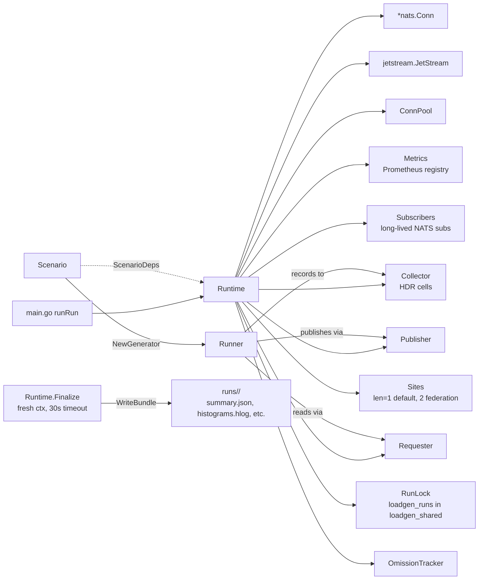

# loadgen architecture

Component dependency graph showing the per-run lifecycle wiring introduced
in Phase 0 + Phase 2.

## Key invariants

- `Runtime` owns all per-run dependencies. `executeRun` constructs scenarios via `ScenarioDeps`, never via globals.
- `Runtime.Finalize` uses a fresh context (not the signal-cancelled one) so artifact writes survive SIGTERM.
- `RunLock` lives in a SHARED Mongo DB (`loadgen_shared`), not the per-run DB — concurrent runs in different per-run DBs would never see each other otherwise.
- `Subscribers.Close()` drains BEFORE `nc.Drain()` so unsubscribes flush cleanly.
