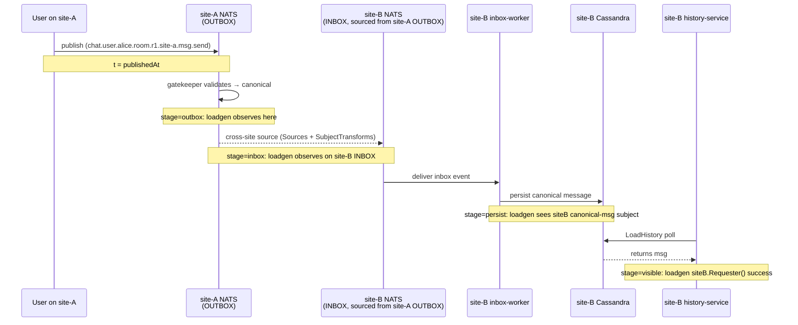

# federation-lag scenario (Phase 3 §3.9)

## Architecture

2-site federation: site-a + site-b. Each site has its own NATS (with
JetStream), Mongo, Cassandra, and service stack. Cross-site events flow via
the OUTBOX→INBOX pattern: site-a's OUTBOX is sourced into site-b's INBOX
(and vice versa) via JetStream `Sources` + `SubjectTransforms`.

## Cross-site flow diagram



The 4 stages map to `loadgen_federation_lag_seconds{stage}` histogram labels.
E2E ≈ visible (it's the cumulative). Per-stage isolation lets ops pinpoint
the slow link.

## Four lag stages

| Stage   | From → To                                          |
|---------|----------------------------------------------------|
| outbox  | publishedAt → observer sees event on siteA OUTBOX  |
| inbox   | siteA OUTBOX → event sourced into siteB INBOX      |
| persist | siteB INBOX → siteB canonical message persisted    |
| visible | siteB persist → readable via siteB.LoadHistory     |

E2E = sum of all 4 (or independently observed). Per-stage isolation matters:
ops can pinpoint whether replication, persistence, or read-side caching is
the bottleneck.

## Sub-modes

- `--federation-flap`: every `--flap-period` (default 60s), kill site-b
  containers for `--flap-down` (default 30s), restart, measure backlog drain
  via `loadgen_federation_flap_drain_seconds`.
- `--federation-cross-read`: siteA user polls siteB history. Reports
  `loadgen_federation_cross_read_seconds`.

## Compose overlay

`deploy/docker-compose.federation.yml` provisions the secondary site
(gated by the `federation` Compose profile):

- nats-site-b, mongo-site-b (Phase 3.9 initial landing)
- TODO follow-up: cassandra-site-b + all per-site workers

```
docker compose -f docker-compose.loadtest.yml -f docker-compose.federation.yml \
  --profile federation up -d
```

Pass `--federation-secondary-nats-url=nats://nats-site-b:4222` to the
`loadgen run` command to wire site-b into the scenario.

## CLAUDE.md §6 compliance

Cross-site `Sources + SubjectTransforms` is ops/IaC-owned. The
`tools/loadgen/testdata/federation/streams.json` fixture is loaded by the
integration test setup helper — NOT by loadgen production code. The
integration test imitates ops, not the loadgen process.

## Metrics

| Metric                                      | Labels         | Description                                  |
|---------------------------------------------|----------------|----------------------------------------------|
| `loadgen_federation_lag_seconds`            | `stage`        | Per-stage cross-site replication lag          |
| `loadgen_federation_flap_drain_seconds`     | —              | Time from site-b restart to first INBOX event |
| `loadgen_federation_cross_read_seconds`     | —              | siteA user reading siteB room history latency |

## Status

Phase 3.9 SKELETON. The scenario registers, has real per-stage tracker logic
+ 4-flag parsing, and the Compose overlay declares the secondary NATS + Mongo.
`Runtime.Sites()` returns 2 `SiteDeps` when `--federation-secondary-nats-url`
is set (real dial, not a stub). Real testcontainer integration test + full
per-site service overlay deferred to Phase 3.9 follow-up.
