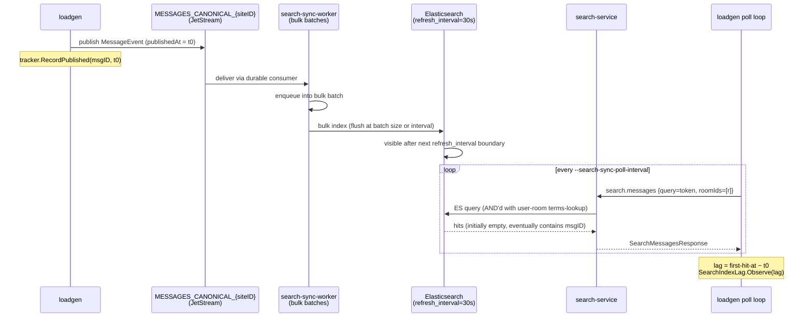
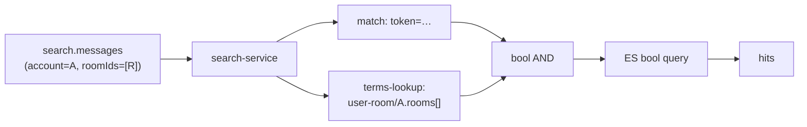

# search-sync-lag scenario (Phase 3 §3.8)

## What it measures

End-to-end **publish → ES-visible** lag for canonical message events as they
flow through `search-sync-worker` into Elasticsearch and become returnable by
`search-service`. The scenario publishes a canonical `MessageEvent` carrying a
unique searchable token, then polls `search.messages` until that document
surfaces. The histogram observation is the wall-clock duration between
publishing on `MESSAGES_CANONICAL_{siteID}` and the first `search.messages`
reply that includes the matching `messageID`.

Operationally this is the lag operators care about when tuning ES
`refresh_interval`, `search-sync-worker` bulk-batch sizing, or sizing the ES
cluster — it's the latency a real user experiences between "I sent a message"
and "that message turns up in search". Unlike `raw-consistency` (which
measures history-API visibility, dominated by Cassandra), this scenario is
dominated by ES `refresh_interval` (default `30s`) and the bulk-flush slack
on top of it.

## Pipeline



The bulk of the observed lag is the ES refresh tail. The publish path and the
`search.messages` RPC are sub-second; everything else is "wait for ES refresh
to catch up".

See [`scenario_searchsync.go:1-50`](../../scenario_searchsync.go) for the
package doc that this section paraphrases.

## Why `--inject=canonical` is required

`NewGenerator` refuses the run with an explicit error unless the operator
passes `--inject=canonical`:

```go
if deps.InjectMode() != InjectCanonical {
    return nil, fmt.Errorf(
        "search-sync-lag requires --inject=canonical (got %q): ...",
        deps.InjectMode())
}
```

[`scenario_searchsync.go:96-103`](../../scenario_searchsync.go)

With `--inject=frontdoor` (the default), loadgen's publisher uses **core
NATS**. The canonical subject `chat.msg.canonical.{siteID}.created` is served
by JetStream only — there is no core NATS subscriber. A core publish onto
that subject silently dead-letters: no error at publish time, no consumer
ever sees the event, every poll times out, the dashboard is silent.

`--inject=canonical` switches loadgen's publisher to JetStream so the publish
actually lands on `MESSAGES_CANONICAL_{siteID}` where `search-sync-worker`
consumes it.

This is the single most common misconfiguration. The `publish_error` outcome
will fire loudly if you forget; see the
[runbook](../runbooks/loadgen-search-sync-zero-observations.md) for triage.

## The ACL precondition

`search-service`'s `search.messages` handler does not return a hit just
because the document is in ES. It AND's the caller's `roomIds` filter against
a **terms-lookup** clause that resolves the caller's allowed rooms via a
per-user document in a separate ES index:



[`search-service/query_messages.go:88,120,135-141`](../../../../search-service/query_messages.go)

The per-user `user-room` doc is written **exclusively** by
`search-sync-worker`'s `user-room-sync` consumer in response to
`OutboxMemberAdded` and `OutboxMemberRemoved` events on the local INBOX
stream. See [`search-sync-worker/user_room.go:35-37`](../../../../search-sync-worker/user_room.go)
(the consumer name `user-room-sync` is what you'll see in
`nats consumer info`).

Loadgen's `Seed` only writes Mongo (subscriptions, rooms, users). It never
touches ES. So out of the box, the `user-room` ACL doc for the fixture
accounts does not exist, every `search.messages` query AND's against an empty
allowed-rooms set, every search returns 0 hits, every poll times out, the
dashboard is silent.

### How the scenario solves it

At the start of `Run`, before the per-tick publish/poll loop, the scenario
publishes one synthetic `OutboxMemberAdded` event per unique `(account,
roomID)` fixture tuple onto the local INBOX subject:

```go
subj := subject.InboxMemberAdded(siteID)  // chat.inbox.{siteID}.member_added
// for each unique (account, roomID) in fixture subscriptions:
publisher.Publish(ctx, subj, marshalledOutboxEvent)
```

[`scenario_searchsync.go:255-299`](../../scenario_searchsync.go)

`search-sync-worker`'s `user-room-sync` consumer picks them up, builds the
per-user `user-room` ES doc, and bulk-indexes it. The scenario then waits
`--search-sync-acl-wait` (default `35s`, covers ES `refresh_interval=30s`
plus bulk-flush slack) before driving traffic — otherwise the first wave of
publishes outruns the ACL warm-up and shows up as a `timeout` cluster at the
head of the run.

This is purely additive ES state. Loadgen does not delete the `user-room`
docs on teardown; in the dev/test environment the `user-room` index is
loadgen-isolated by `search-sync-worker`'s config.

## Sizing the run

The scenario is an **open-loop, publish-then-poll** generator. Each tick
publishes once, then schedules an independent poll goroutine that polls
`search.messages` every `--search-sync-poll-interval` until the doc is
visible or `--search-sync-timeout` elapses.

**In-flight ceiling:** the number of concurrent poll goroutines is bounded
by `MAX_IN_FLIGHT` (env var, default `200`). The scenario uses a buffered
channel as a semaphore; when full, subsequent publishes still happen but the
poll is **skipped** and the `dropped_inflight` outcome counter fires
([`scenario_searchsync.go:213-218`](../../scenario_searchsync.go)). This is
intentional: without the bound, a slow SUT turns the scenario into a
self-DoS — at 100 rps × 60 s timeout ÷ 250 ms poll = 1.44 M RPCs/min.

**Sustainable rate.** A poll goroutine lives roughly `--search-sync-timeout`
seconds in the worst case (the typical "timeout" path is the slowest
case; the "visible" path completes ≈ `refresh_interval` after publish).
Sustained `dropped_inflight=0` requires:

```
rate × timeout ≲ MAX_IN_FLIGHT
```

With defaults (`MAX_IN_FLIGHT=200`, `--search-sync-timeout=90s`), that's
`rate ≲ 2/s`. The Generator's default `--rate=500` is set for the
high-volume `messaging-pipeline` and **will saturate the semaphore on the
first second** of a search-sync-lag run.

**Recommended starting point:**

```bash
loadgen run \
  --scenario=search-sync-lag \
  --inject=canonical \
  --rate=1 \
  --duration=10m \
  --preset=search-read
```

Then raise `--rate` gradually while watching
`loadgen_search_index_visible_total{outcome="dropped_inflight"}`. Prefer
running longer (`--duration=10m+`) rather than faster — the ES refresh
tail dominates the signal and short runs don't fill the histogram.

## Histogram bucket geometry

`loadgen_search_index_lag_seconds` is an **unlabeled** histogram with
non-exponential buckets explicitly tuned for the 30 s ES `refresh_interval`
SLO:

```
0.5, 1, 2, 5, 10, 20, 25, 30, 35, 40, 50, 70, 100, 150, 300
```

[`metrics.go:220-231`](../../metrics.go)

The 20–50 s region has five buckets so the p50/p95/p99 around the
30 s SLO are resolvable on a dashboard. The fat right tail (70/100/150/300)
captures the long tail caused by ES compactions, JVM GC pauses, and
bulk-flush slack.

A previous version used `ExponentialBuckets(0.1, 2, 12)`, which collapsed
25.6 s → 51.2 s into a single bucket — a dashboard could not tell "just
barely meeting SLO" from "just barely missing SLO". Don't reintroduce that.

Reading the histogram:

- **p50 ≈ refresh_interval / 2 + bulk-flush slack** is healthy. With
  defaults, expect p50 around 18–25 s.
- **p99 ≫ refresh_interval × 2** indicates the long tail is dominated by
  something other than refresh — bulk-batch saturation, ES under capacity,
  or a sync-worker consumer lag. Cross-check `nats consumer info
  MESSAGES_CANONICAL_{siteID} search-sync-worker-messages` (or the
  collection-specific consumer name) for pending count.

The scenario does not change `refresh_interval` or bulk sizing — it only
measures the resulting visibility lag. To A/B different SUT configurations,
run the scenario twice with different SUT settings and compare via
[`cmd/compare-runs`](../../cmd/compare-runs/main.go).

## Outcome counter taxonomy

`loadgen_search_index_visible_total{outcome}` is the triage anchor.
[`scenario_searchsync.go:121-133`](../../scenario_searchsync.go) is the
canonical taxonomy:

| Outcome            | When it fires                                                                  | Most likely cause                                                                  |
|--------------------|--------------------------------------------------------------------------------|------------------------------------------------------------------------------------|
| `visible`          | Poll observed the msgID in a `search.messages` hit; lag observed.              | Happy path.                                                                        |
| `timeout`          | `--search-sync-timeout` elapsed without a hit.                                 | ES slower than expected, sync-worker behind, **or ACL doc missing** (see runbook). |
| `transport_error`  | The NATS request to `search.messages` itself failed (not a 0-hit reply).       | search-service down, NATS partitioned, request-reply timeout (`RequestTimeout`).   |
| `publish_error`    | The canonical publish to JetStream failed; no poll was scheduled.              | `--inject=frontdoor`, MESSAGES_CANONICAL stream missing, NATS creds wrong.         |
| `dropped_inflight` | Publish succeeded but the in-flight semaphore was full; poll was skipped.      | `rate × timeout > MAX_IN_FLIGHT`. Lower rate or raise MAX_IN_FLIGHT.                |

For an operator staring at a silent dashboard, this counter is the entry
point to the
[zero-observations runbook](../runbooks/loadgen-search-sync-zero-observations.md).

## Tuning knobs

All three scenario-specific flags are defined in
[`flags.go:193-205,296-301`](../../flags.go).

| Flag                           | Default | When to change it                                                                                 | Trade-off                                                                                                          |
|--------------------------------|---------|---------------------------------------------------------------------------------------------------|--------------------------------------------------------------------------------------------------------------------|
| `--search-sync-poll-interval`  | `250ms` | Lower to ~100 ms when measuring a SUT with `refresh_interval` ≪ 30 s (custom-tuned ES).            | Lower interval → more RPCs/min/inflight-poll. Polling faster than ES refreshes wastes RPCs without resolution gain. |
| `--search-sync-timeout`        | `90s`   | Raise when investigating long-tail outliers or running with a degraded ES cluster.                | Higher timeout → longer-lived poll goroutines → in-flight semaphore fills sooner at a given `--rate`.              |
| `--search-sync-acl-wait`       | `35s`   | Raise on slow clusters where the user-room bulk-flush isn't observable within 30 s.               | Pure added warm-up; the publish/poll loop is idle during this window. Lower bound is ES `refresh_interval`.        |

Note: `--rate` and `MAX_IN_FLIGHT` are general loadgen knobs, not
scenario-specific, but they govern this scenario more tightly than most.
See the [sizing](#sizing-the-run) section.

## Comparing runs

Use `cmd/compare-runs` to A/B two artifact bundles — for example, to
compare ES `refresh_interval=30s` vs `refresh_interval=10s`:

```bash
# Run 1: defaults
loadgen run --scenario=search-sync-lag --inject=canonical \
  --rate=1 --duration=15m --preset=search-read

# (operator changes ES refresh_interval in search-sync-worker config, restarts)

# Run 2: tuned
loadgen run --scenario=search-sync-lag --inject=canonical \
  --rate=1 --duration=15m --preset=search-read

# Compare
go run ./tools/loadgen/cmd/compare-runs \
  runs/<run_1_id> runs/<run_2_id>
```

The `compare-runs` tool diffs p50/p95/p99 across the two bundles. The
scripted equivalent is [`scripts/compare-runs.sh`](../../scripts/compare-runs.sh).

## Known limitations

- **35 s ACL warm-up adds dead time to every run.** There is no
  `--skip-acl-bootstrap` knob today. If you've manually pre-seeded the
  `user-room` index (e.g. from a previous run on the same dev environment)
  the bootstrap is harmless duplicate work — the user-room actions are
  idempotent — but the wait still happens. Plan run duration accordingly:
  a 5-minute run with default `--search-sync-acl-wait=35s` only has
  ~4.4 minutes of measurement.

- **`transport_error` only covers the poll path, not bootstrap.** If the
  one-shot ACL bootstrap publish fails, `Run` returns the error and the
  scenario exits before any tick happens — you'll see no metrics at all,
  not a `transport_error` count. Operators triaging "no metrics" should
  check the loadgen log for `bootstrap search-sync ACL:` before reaching
  for the outcome counter.

- **No federated mode.** The scenario publishes onto the **local** INBOX
  subject (`subject.InboxMemberAdded(siteID)`), not the federated
  aggregate. It exercises a single site's search pipeline only. Combining
  with `--federation` is a future enhancement.

- **`search-sync-worker` consumer pending count is not exported as a
  loadgen metric.** When triaging `timeout`-dominant runs you'll need to
  reach for `nats consumer info` directly; the loadgen dashboard cannot
  show you sync-worker backlog.

## See also

- Quick reference: [USAGE.md → search-sync-lag](../../USAGE.md#search-sync-lag)
- Runbook: [loadgen-search-sync-zero-observations](../runbooks/loadgen-search-sync-zero-observations.md)
- Release notes: [CHANGES.md → search-sync-lag](../../CHANGES.md)
- Implementation: [`scenario_searchsync.go`](../../scenario_searchsync.go)
- Metrics: [`metrics.go:58-74,220-235`](../../metrics.go)
- SUT-side ACL gate: [`search-service/query_messages.go:88,120,135-141`](../../../../search-service/query_messages.go)
- SUT-side ACL writer: [`search-sync-worker/user_room.go`](../../../../search-sync-worker/user_room.go)
